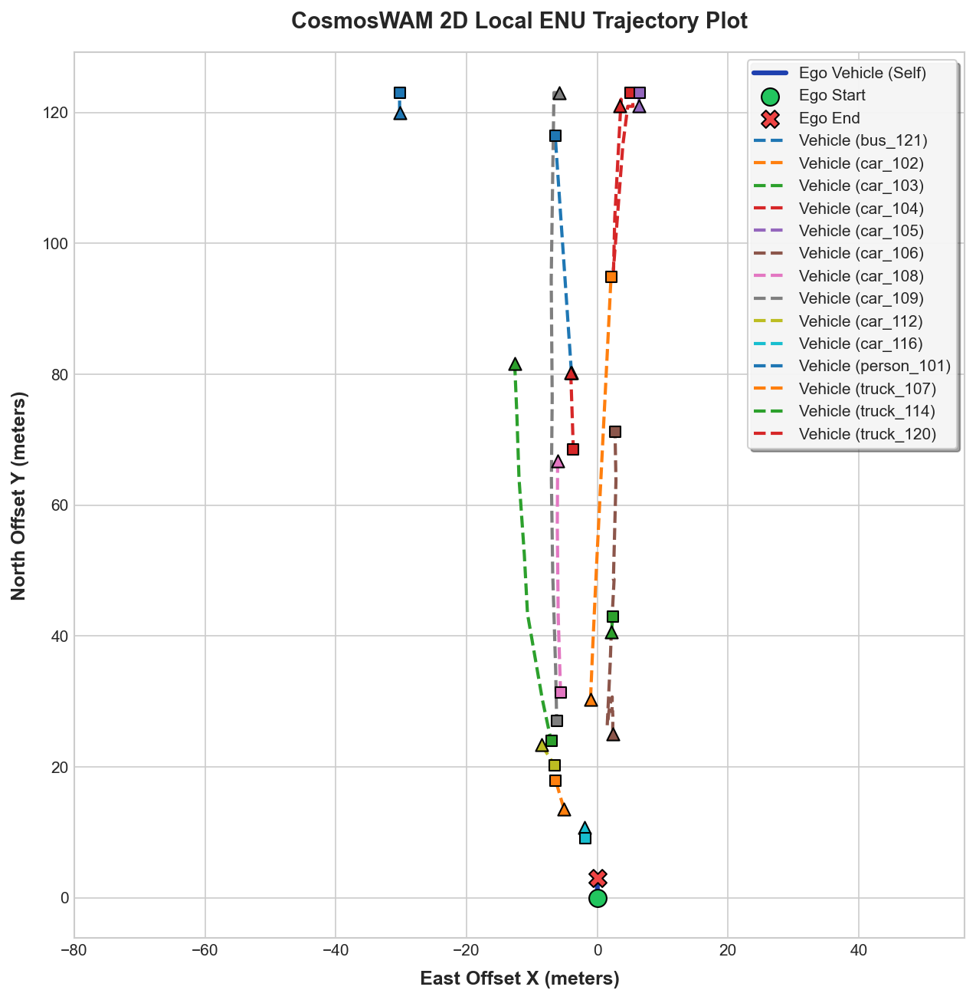
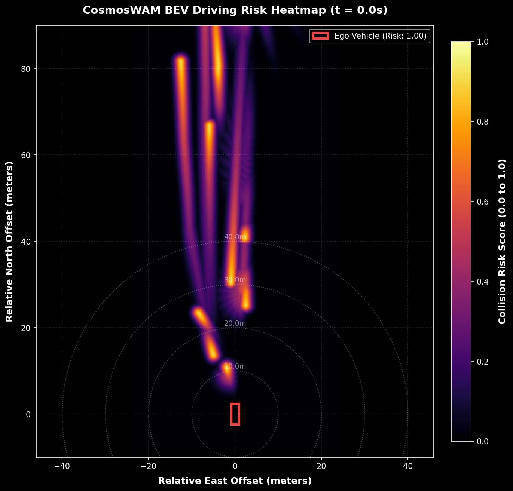
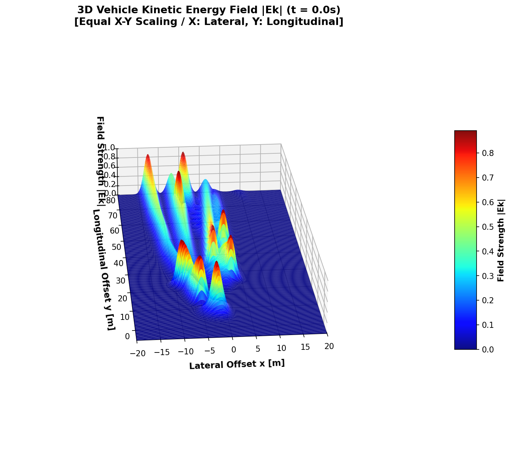

# CosmosWAM: Modular Autonomous Driving Vision & Safety Assessment Pipeline
# CosmosWAM 自动驾驶多目标感知跟踪与行车安全评估系统

CosmosWAM is an end-to-end autonomous driving perception, tracking, coordinate projection, and dynamic safety potential field risk assessment client. It integrates remote AI model generation (Cosmos-3 video forecasting and LocateAnything target detection) with a pure, high-performance local C++ execution pipeline.

CosmosWAM 是一个端到端的自动驾驶感知、多目标跟踪、大地/局部坐标投影及动态驾驶安全场评估系统。系统将云端大模型推理生成能力（Cosmos-3 视频预测、LocateAnything 目标检测）与本地高性能 C++ 数据管道进行无缝整合。

---

## 🛠️ Pipeline Architecture / 管道模块与系统架构

The pipeline is strictly divided into 7 modules, executing sequentially. The system coordinates the process through a fail-fast scheduler:
本系统由七个高度内聚的子模块组成，按顺序链式执行，并通过高鲁棒性的管道调度器进行协调控制：

### 📌 System Workflow Diagram / 系统工作流文字图

```text
========================================================================================
                          CosmosWAM Pipeline Flow & Interfaces
========================================================================================

    [ 本地 Local Client ]                              [ 云端 GPU Server ]
 ┌─────────────────────────┐
 │   Module 1: Uploader    │
 │ (本地待处理图像文件上传) │
 └────────────┬────────────┘
              │  SCP Upload File
              │  (InputImage.png -> /tmp/InputImage.png)
              ▼
              │          ┌───────────────────────────────────┐
              │          │        Module 2: FD Runner        │
              │          │  (Cosmos-3 视频生成动力学推演)   │
              │          └─────────────────┬─────────────────┘
              │                            │  bash run_cosmos.sh
              │                            ▼
              │          ┌───────────────────────────────────┐
              │          │        Module 3: LA Runner        │
              │          │    (LocateAnything 2D目标检测)    │
              │          └─────────────────┬─────────────────┘
              │                            │  bash run_locateAnything.sh
              │                            ▼
              │          ┌───────────────────────────────────┐
              │          │          Remote Outputs           │
              │          │  - OutputVideo.mp4 (原始预测)     │
              │          │  - OutputVideo_detected.mp4 (检测)│
              │          │  - OutputVideo_detected.json (框) │
              │          │  - OutputVideo_ego_trajectory.json│
              │          └─────────────────┬─────────────────┘
              │                            │
  (SCP Copy)  │                            │  (SCP Copy)
  OutputVideo.mp4                          │  Detections & Trajectories
              │                            │
              ▼                            ▼
 ┌───────────────────────────────────────────────────────────┐
 │                    Module 4: Downloader                   │
 │                (拉取云端推理结果及预测视频)               │
 └─────────────────────────────┬─────────────────────────────┘
                               │
                               ▼  [Local Output Path]
                               │  - ./output/OutputVideo.mp4
                               │  - ./output/OutputVideo_detected.json
                               │  - ./output/OutputVideo_ego_trajectory.json
                               ▼
 ┌───────────────────────────────────────────────────────────┐
 │                  Module 5: Target Tracker                 │
 │            (匈牙利 IoU 连续轨迹跟踪 + 车头 ROI 过滤)      │
 └─────────────────────────────┬─────────────────────────────┘
                               │  Outputs: 2D Trajectories
                               ▼  - ./output/OutputVideo_trajectories.json
 ┌───────────────────────────────────────────────────────────┐
 │                Module 6: Coord Transformer                │
 │         (逆透视投影 IPM -> 相机 3D -> 局部 ENU -> WGS-84)  │
 └─────────────────────────────┬─────────────────────────────┘
                               │  Outputs: 3D coordinates & GPS info
                               ▼  - ./output/OutputVideo_trajectories.json (enriched)
 ┌───────────────────────────────────────────────────────────┐
 │                  Module 7: Risk Assessor                  │
 │      (动态安全势能/动能场叠加计算 + 0.05s 高频轨迹插值)   │
 └─────────────────────────────┬─────────────────────────────┘
                               │  Outputs: BEV safety field grid
                               ▼  - ./output/frame_result.json
 ┌───────────────────────────────────────────────────────────┐
 │                  Python Visualization                     │
 │          (2D 轨迹图、2D/3D BEV 驾驶安全场热力图绘制)      │
 └───────────────────────────────────────────────────────────┘
```

### 📌 System Module Relationship Diagram / 系统模块关系框图

```mermaid
graph LR
    %% ==========================================
    %% 子图区域定义（输入与云端推理、本地高性能数据管道、可视化输出）
    %% ==========================================
    subgraph DataInference ["数据源与云端推理 (Data Source & Cloud Inference)"]
        direction TB
        InputImage["输入图像<br>InputImage.png"]
        Uploader["Module 1: Uploader<br>本地图片安全上传"]
        FD_Runner["Module 2: FD Runner<br>Cosmos-3 视频生成动力学推演"]
        LA_Runner["Module 3: LA Runner<br>LocateAnything 2D目标检测"]
    end

    subgraph LocalPipeline ["本地 C++ 数据处理管道 (Local C++ Data Pipeline)"]
        direction TB
        Downloader["Module 4: Downloader<br>SCP 数据同步拉取"]
        TargetTracker["Module 5: Target Tracker<br>IoU 轨迹跟踪 + 引擎盖 ROI 过滤"]
        CoordTransformer["Module 6: Coord Transformer<br>IPM 逆透视投影 & 坐标变换 (ENU/GPS)"]
        RiskAssessor["Module 7: Risk Assessor<br>动态安全势能/动能场评估"]
    end

    subgraph DownstreamOutput ["可视化与下游输出 (Downstream Outputs)"]
        direction TB
        TrajPlot["2D 轨迹投影图<br>trajectory_plot.png"]
        RiskHeatmap["2D BEV 风险热力图<br>risk_heatmap.png"]
        Risk3D["3D 等比例动能场图<br>risk_heatmap_3d.png"]
    end

    %% ==========================================
    %% 模块连接与数据流向接口
    %% ==========================================
    InputImage -->|Local File| Uploader
    Uploader -->|InputImage.png| FD_Runner
    FD_Runner -->|OutputVideo.mp4| LA_Runner
    LA_Runner -->|Detections & Trajectories| Downloader
    
    Downloader -->|OutputVideo_detected.json| TargetTracker
    TargetTracker -->|2D Trajectories| CoordTransformer
    Downloader -->|OutputVideo_ego_trajectory.json| CoordTransformer
    
    CoordTransformer -->|3D ENU & GPS Trajectories| RiskAssessor
    
    RiskAssessor -->|frame_result.json| TrajPlot
    RiskAssessor -->|frame_result.json| RiskHeatmap
    RiskAssessor -->|frame_result.json| Risk3D

    %% ==========================================
    %% 自定义风格样式（匹配示例图的黄/紫配色）
    %% ==========================================
    %% 子图（黄底）
    style DataInference fill:#fefce8,stroke:#eab308,stroke-width:2px;
    style LocalPipeline fill:#fefce8,stroke:#eab308,stroke-width:2px;
    style DownstreamOutput fill:#fefce8,stroke:#eab308,stroke-width:2px;

    %% 模块节点（紫底、深紫/蓝边框）
    style InputImage fill:#e8e5ff,stroke:#8b5cf6,stroke-width:1.5px;
    style Uploader fill:#e8e5ff,stroke:#8b5cf6,stroke-width:1.5px;
    style FD_Runner fill:#e8e5ff,stroke:#8b5cf6,stroke-width:1.5px;
    style LA_Runner fill:#e8e5ff,stroke:#8b5cf6,stroke-width:1.5px;
    
    style Downloader fill:#e8e5ff,stroke:#8b5cf6,stroke-width:1.5px;
    style TargetTracker fill:#e8e5ff,stroke:#8b5cf6,stroke-width:1.5px;
    style CoordTransformer fill:#e8e5ff,stroke:#8b5cf6,stroke-width:1.5px;
    style RiskAssessor fill:#e8e5ff,stroke:#8b5cf6,stroke-width:1.5px;
    
    style TrajPlot fill:#e8e5ff,stroke:#8b5cf6,stroke-width:1.5px;
    style RiskHeatmap fill:#e8e5ff,stroke:#8b5cf6,stroke-width:1.5px;
    style Risk3D fill:#e8e5ff,stroke:#8b5cf6,stroke-width:1.5px;
```



---

## ⛓️ Module Decomposition & I/O / 模块分解与输入输出关系

Below is a detailed breakdown of each module's implementation, language, inputs, outputs, and internal algorithms:

| Module / 模块 | Source Location / 源码路径 | Language | Inputs / 输入 | Outputs / 输出 | Key Algorithms & Logic / 核心算法与逻辑 |
| :--- | :--- | :--- | :--- | :--- | :--- |
| **Module 1:<br>Uploader** | `modules/uploader/` | C++ | Local source image:<br>`./input/InputImage.png` | Remote target image:<br>`/tmp/InputImage.png` | **Atomic Write**: SCP uploads file as `InputImage.png.tmp` first, then atomically renames to `InputImage.png` on the remote server to prevent write conflicts. |
| **Module 2:<br>FD Runner** | `modules/fd_runner/` | C++ | Remote image:<br>`InputImage.png` | Remote forecasted video:<br>`OutputVideo.mp4`<br>Local copy:<br>`./output/OutputVideo.mp4` | **Cosmos-3 AI Inference**: Triggers `run_cosmos.sh` via SSH to run video prediction. Generates 3-second future video. Renamed from `.tmp` upon completion.<br>**Local Download**: Automatically downloads the generated video to the local `output/` folder using the atomic rename protocol. |
| **Module 3:<br>LA Runner** | `modules/la_runner/` | C++ | Remote video:<br>`OutputVideo.mp4` | Remote detections:<br>`OutputVideo_detected.json`,<br>`OutputVideo_detected.mp4`,<br>`OutputVideo_ego_trajectory.json` | **LocateAnything Inference**: Triggers `run_locateAnything.sh` via SSH to perform 2D box extraction on video frames and record simulated ego vehicle kinematics. |
| **Module 4:<br>Downloader** | `modules/downloader/` | C++ | Remote detections & video | Local download cache:<br>`./output/OutputVideo_detected.json`,<br>`./output/OutputVideo_detected.mp4`,<br>`./output/OutputVideo_ego_trajectory.json` | **Secure File Retrieval**: SCP downloads remote detection assets to local cache folders. Employs `.tmp` target naming for download robustness. |
| **Module 5:<br>Target Tracker** | `modules/target_tracker/` | C++ | Bounding box JSON:<br>`OutputVideo_detected.json` | Tracked trajectories:<br>`./output/OutputVideo_trajectories.json` | **Hungarian IoU Matching**: Associates 2D bbox frames into trajectory IDs.<br>**ROI Masking**: Ignores boxes where `ymin > 300.0` and `width > 350.0` (ego vehicle hood filter).<br>**Temporal Smoothing**: Sliding-window coordinate smoothing. |
| **Module 6:<br>Coord Transformer** | `modules/coord_transformer/` | C++ | 2D Bbox trajectories & Ego GPS | Projected 3D trajectories:<br>`./output/OutputVideo_trajectories.json`<br>*(Modified with 3D and Geodetic data)* | **Inverse Perspective Mapping (IPM)**: Projects image coordinates to 3D camera coordinates.<br>**Rotation matrices**: Roll, pitch, and yaw transformation to local East-North-Up (ENU) frame.<br>**ENU to WGS-84**: Estimates coordinate offsets to absolute GPS (Lat, Lon). |
| **Module 7:<br>Risk Assessor** | `modules/risk_assessor/` | C++ | Ego states & Env GPS trajectories | Spatial BEV risk matrix:<br>`./output/frame_result.json` | **Unified Dynamic Safety Field**: Models vehicle safety fields using potential fields (repulsion) and dynamic kinetic energy (heading & speed).<br>**High-Frequency Interpolation**: Performs `0.05s` linear path interpolation.<br>**Exponential Scaling**: Scales risk values dynamically along normalized timestamps (`norm_t` decay from `0.9` at start to `0.2` at end). |

---

## ⚙️ Pipeline Scheduler & Verification / 管道调度与校验机制

All modules are orchestrated under the `PipelineScheduler` class. The scheduler implements a **fail-fast step verification mechanism** to ensure execution correctness:
* **Pre-requisite Status Check**: Before starting any module, the scheduler actively verifies that the previous step's final output file exists and is complete.
* **Atomic Rename Protocol**: File-producing modules (Uploader, Downloader, Coordinate Transformer, Risk Assessor) first write to temporary files with a `.tmp` suffix. Once the operation completes, it renames the file to its final format. If a step fails, the pipeline halts immediately, returning a specific non-zero error code to prevent cascade failures.

---

## 📂 Project Directory Structure / 项目目录结构

```text
.
├── CMakeLists.txt              # Root CMake configuration
├── src/
│   ├── main.cpp                # App entry point (cosmos_wam_client)
│   └── pipeline_scheduler.cpp  # Pipeline orchestrator & verification implementation
├── include/
│   └── cosmos_wam/             # Shared headers & structure definitions
│       └── pipeline_scheduler.h # Pipeline orchestrator header
├── modules/
│   ├── remote_executor/        # SSH & SCP implementation wrapper
│   ├── uploader/               # Module 1 (SCP Upload)
│   ├── fd_runner/              # Module 2 (Cosmos-3 Video Generation)
│   ├── la_runner/              # Module 3 (LocateAnything Detections)
│   ├── downloader/             # Module 4 (SCP Download)
│   ├── target_tracker/         # Module 5 (Hungarian IoU Tracking & ROI filtering)
│   ├── coord_transformer/      # Module 6 (IPM -> Camera -> ENU -> WGS-84)
│   └── risk_assessor/          # Module 7 (Kinetic Field Risk Assessment Grid)
├── input/
│   └── InputImage.png          # Default input image
├── docs/                       # Diagrams, specifications and visualization images
│   ├── pipeline_block_diagram.png
│   ├── trajectory_plot.png
│   ├── risk_heatmap.png
│   └── risk_heatmap_3d.png
├── output/                     # Generated results, intermediate JSON caches & logs
├── plot_trajectories.py        # Visualizes local ENU trajectories
├── plot_risk_map.py            # Visualizes 2D BEV risk heatmap
├── plot_risk_map_3d.py         # Visualizes 3D equal-scale kinetic energy surface
└── README.md                   # This documentation
```

---

## 🔨 Build Instructions / 编译与安装

### Prerequisites / 依赖环境
* **Operating System**: macOS or Linux
* **C++ Compiler**: Supporting C++17 (e.g., GCC >= 8, Clang >= 10)
* **Build Tool**: CMake >= 3.15
* **Execution Utilities**: `expect` (required locally for remote SSH/SCP password automation)
* **Python Environment**: Python 3 with `numpy` and `matplotlib` installed for visualization scripts

### Compile / 编译步骤
Execute the following commands in the project root directory:
```bash
mkdir -p build
cd build
cmake ..
make -j4
cd ..
```
The compiled binary executable will be generated at `./build/cosmos_wam_client`.

---

## 🚀 Execution Guide / 运行指南

The client executable supports two main execution modes:

### 1. Local-Only Mode / 本地测试模式 (Bypassing SSH/SCP)
If you have already downloaded the JSON assets from the remote server, you can execute the local C++ data processing pipeline (Modules 5-7) directly:
```bash
./build/cosmos_wam_client local
```
* **Inputs read from**: `./output/OutputVideo_detected.json` & `./output/OutputVideo_ego_trajectory.json`
* **Outputs written to**: `./output/OutputVideo_trajectories.json` & `./output/frame_result.json`

### 2. End-to-End Remote Mode / 云端全联调模式
To execute the complete 7-module pipeline (which connects to the remote GPU server for AI inference):
```bash
./build/cosmos_wam_client <host> <user> <password>
```
For example:
```bash
./build/cosmos_wam_client 192.168.50.254 user_name user_password
```
* **Process**: Connects to the host, uploads image, runs Cosmos-3 and LocateAnything, downloads results, tracks vehicles, projects coordinates, and outputs risk fields.

---

## 📊 Result Visualizations / 数据可视化

After the pipeline runs successfully, you can run three visualization scripts to generate intuitive charts.

### A. Trajectory Plot / 2D 轨迹投影图
Visualizes the ego vehicle and all environmental vehicles' trajectories in local ENU coordinates.
* **Triangle (`^`)** represents the initial position.
* **Square (`s`)** represents the final recorded position.
```bash
python3 plot_trajectories.py
```
*Generated file: `./output/trajectory_plot.png`*


### B. 2D BEV Heatmap / 2D BEV 风险热力图
Renders a top-down bird's-eye-view of the driving safety potential field.
```bash
python3 plot_risk_map.py
```
*Generated file: `./output/risk_heatmap.png`*


### C. 3D Kinetic Energy Field / 3D 等比例动能场图
Plots a 3D equal-scale surface of the unified safety potential field at the first frame ($t = 0.0$s):
* Spans $X \in [-20, 20]$ meters laterally and $Y \in [-5, 80]$ meters longitudinally.
* The Z-axis represents the dynamic field strength ($[0, 1.0]$).
* Shows how risk peaks near the vehicles and decays smoothly along their paths.
```bash
python3 plot_risk_map_3d.py
```
*Generated file: `./output/risk_heatmap_3d.png`*


