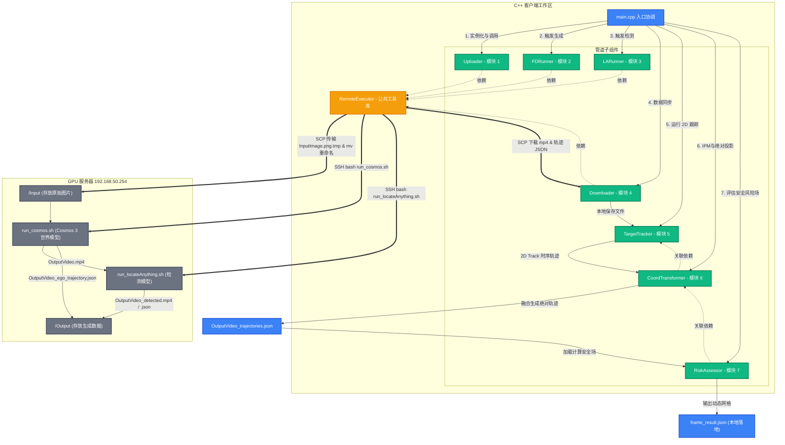

# CosmosWAM 远程模块化客户端设计与运行手册

本文档汇总了 CosmosWAM 远程 C++ 协调客户端的设计方案、软件架构、编译及运行方法。

---

## 1. 软件概述 (Overview)

本客户端是一个使用 C++17 编写的高性能控制与数据拉取工具。其核心目的是**以阻塞、高可靠的方式远程调度 GPU 服务器**上的 Cosmos 3 世界模型与 LocateAnything 目标检测模型，实现“**输入图片 ➔ 生成预测视频 ➔ 感知提取轨迹 ➔ 本地打包同步**”的闭环数据生成管线。

---

## 2. 系统架构与目录结构 (Architecture)

程序采用了**高内聚、低耦合**的静态库目录设计，将执行流拆分为五个独立的子文件夹。每个模块都具备标准的 `include/` 与 `src/` 结构。

```text
cosmosWAM/
├── CMakeLists.txt                      # 根级构建配置文件（管理子目录与静态链接）
├── docs/
│   ├── cosmos_wam_design_simplified.md # 系统总体框图与交互设计
│   ├── cosmos3_perception_tracking_guide.md # 感知、跟踪与单目 3D 转换算法指南
│   └── cosmos_wam_client_summary.md    # 本使用手册
├── input/
│   └── InputImage.png                  # 用户放置的待测试本地图片
├── output/
│   ├── OutputVideo_detected.mp4        # 下载的检测标注可视化视频
│   ├── OutputVideo_detected.json       # 下载的交通参与者检测 Bounding Box 时空数据
│   ├── OutputVideo_ego_trajectory.json # 下载的自车 3D/WGS-84 大地坐标轨迹数据
│   ├── OutputVideo_trajectories.json   # 【新生成】C++ 融合计算出的完整 WGS-84 轨迹文件
│   └── frame_result.json               # 【新生成】C++ 计算输出的 BEV 驾驶风险度网格热力图文件
├── src/
│   └── main.cpp                        # 根级主程序入口，协调各个子模块执行
└── modules/
    ├── remote_executor/                # 【核心底层】封装了基于 Expect/SSH/SCP 的远程控制与传输工具
    ├── uploader/                       # 【模块 1】负责将本地输入图片传输至服务端
    ├── fd_runner/                      # 【模块 2】负责触发 run_cosmos.sh 生成前向预测视频
    ├── la_runner/                      # 【模块 3】负责触发 run_locateAnything.sh 提取目标轨迹
    ├── downloader/                     # 【模块 4】负责将视频及轨迹 JSON 成果下载到本地
    ├── target_tracker/                 # 【模块 5】纯 C++ 实现，对 2D 目标检测进行跨帧时序跟踪
    ├── coord_transformer/              # 【模块 6】纯 C++ 实现，IPM 单目投影、ENU 转换与 WGS-84 经纬度生成
    └── risk_assessor/                  # 【模块 7】纯 C++ 实现，计算自车失稳极限、周围车辆动能场与盲区遮挡阴影
```

### 2.1 模块关系与数据流图 (Module Architecture & Dataflow)

以下是客户端主程序、子模块、底层通信服务及远程 GPU 服务器之间的调用关系与数据流动过程：



---

## 3. 详细设计 (Detailed Design)

### 3.1 基于 Expect 的防超时执行机制
* 远程服务器的深度学习模型推演（VAE 编码、扩散模型采样、VVL 提示词关联）通常耗时较长（30s~120s）。
* 底层 SSH 客户端采用 `expect` 脚本自动注入凭证，并显式指定 `set timeout 600`（10分钟超时限制），彻底杜绝了 SSH 连接因默认 10s 超时而强行断开并下发 `SIGHUP` 信号杀死服务端 Python 进程的问题。

### 3.2 零竞态（Race Condition）临时命名机制
为了防止传输过程中程序对未写完的文件发生误读，系统设计了严格的 `.tmp ➔ 正式` 重命名逻辑：
* **模块 1 (Uploader)**：先将本地图片拷贝为 `/home/.../InputImage.png.tmp`，上传完毕后通过 `mv -f` 将其远程重命名为正式的 `InputImage.png`。
* **模块 2 (Cosmos 运行)**：脚本启动时远程生成 `OutputVideo.tmp` 空文件作为运行指示器，执行结束后自动重命名为 `OutputVideo.mp4` 并保存 `OutputVideo_ego_trajectory.json`。
* **模块 3 (LocateAnything 运行)**：启动后自动创建带 `.tmp` 的临时指示文件，完全输出完成后重命名为 `OutputVideo_detected.mp4` 和 `OutputVideo_detected.json`。
* **模块 4 (Downloader)**：在拷贝前，先通过远程 shell 执行 `test -f` 判定重命名已正式生效。只有在确认所有正式文件落盘后才进行拉取，规避了拉到空文件或破损视频的问题。

---

## 4. 编译方法 (Compilation)

项目使用 CMake 构建系统进行编译。

### 编译步骤：
在工作区根目录下，打开终端并运行以下命令：
```bash
# 1. 配置构建目录
cmake -B build -S .

# 2. 编译项目
cmake --build build
```
编译完成后，会在 `build/` 文件夹下生成静态库及可执行文件 `cosmos_wam_client`。

---

## 5. 运行方法 (Usage)

主程序支持完整的命令行参数，并且各项参数均提供合理的默认值。

### 5.1 命令行参数列表
运行格式为：
```bash
./build/cosmos_wam_client [host] [user] [password] [local_image_path] [duration] [fps] [initial_velocity]
```

* **`host`** *(可选, 默认: 192.168.50.254)*: 远程 GPU 服务器 IP。
* **`user`** *(可选, 默认: qingxu)*: SSH 登录用户名。
* **`password`** *(必选)*: SSH 登录密码。
* **`local_image_path`** *(可选, 默认: ./input/InputImage.png)*: 本地待检测的初始图片路径。
* **`duration`** *(可选, 默认: 3.0)*: Cosmos 仿真视频的持续时间（秒）。
* **`fps`** *(可选, 默认: 10)*: 生成视频的帧率（FPS）。
* **`initial_velocity`** *(可选, 默认: 15.0)*: 自车的初始行驶速度（m/s）。

### 5.2 运行示例

#### 示例 A：使用默认参数运行（推荐）
直接使用位于 `input/InputImage.png` 的本地图片，以 `15m/s` 的自车初始速度生成一个 `3秒、10FPS` 的视频并检测：
```bash
./build/cosmos_wam_client 192.168.50.254 qingxu <your_password>
```

#### 示例 B：手动指定参数运行
使用指定的本地图片，生成 `5秒、15FPS`、自车初始速度为 `20m/s` 的前向动力学视频并进行目标检测：
```bash
./build/cosmos_wam_client 192.168.50.254 qingxu <your_password> ./input/InputImage.png 5.0 15 20.0
```

---

## 6. 可视化展示 (Visualization)

为了直观展现 C++ 融合后的绝对坐标轨迹（Local ENU 米级偏移量），我们提供了一个 Python 可视化绘图脚本 `plot_trajectories.py`：

```bash
# 运行绘图脚本（默认读取 output/OutputVideo_trajectories.json）
python3 plot_trajectories.py
```

该脚本将生成一张分辨率为 150 DPI 的 top-down 俯视平面轨迹图，保存在 **`output/trajectory_plot.png`** 路径下。轨迹图中包括：
* **自车移动轨迹**：深蓝色粗实线，并使用绿色圆点标明起点，红色 X 标明终点。
* **背景参与车辆**：彩色虚线，并以三角形 `^` 标明车辆出现起点，方形 `s` 标明终点。
* **距离刻度**：强制执行 1:1 的物理坐标缩放比例（`equal aspect ratio`），使得图中的直观距离比例即为物理世界的真实米数比例。

同时，我们提供了 **`plot_risk_map.py`** 脚本来绘制 BEV 碰撞风险热力图：

```bash
# 运行风险场热力图绘制（默认读取 output/frame_result.json）
python3 plot_risk_map.py
```

该脚本会生成一张 **`output/risk_heatmap.png`** 图像，包含以下要素：
* **风险温标图（Heatmap）**：采用暗色背景与 `inferno` 危险度温标。亮黄色与亮白色区域为高风险区域（运动车辆弹道前方与卡车阴影盲区交界处）。
* **自车投影边界框（Ego Box）**：画在中心 (0,0) 处，且框线颜色随 $R_{stability}$ 物理失稳指数动态渐变（绿色代表受控，黄色代表警告，红色代表打滑失控风险）。
* **同心圆测距环（Range Rings）**：自动绘制 10m、20m、30m、40m 距离虚线圈，辅助直观读取危险源与自车的相对距离。
