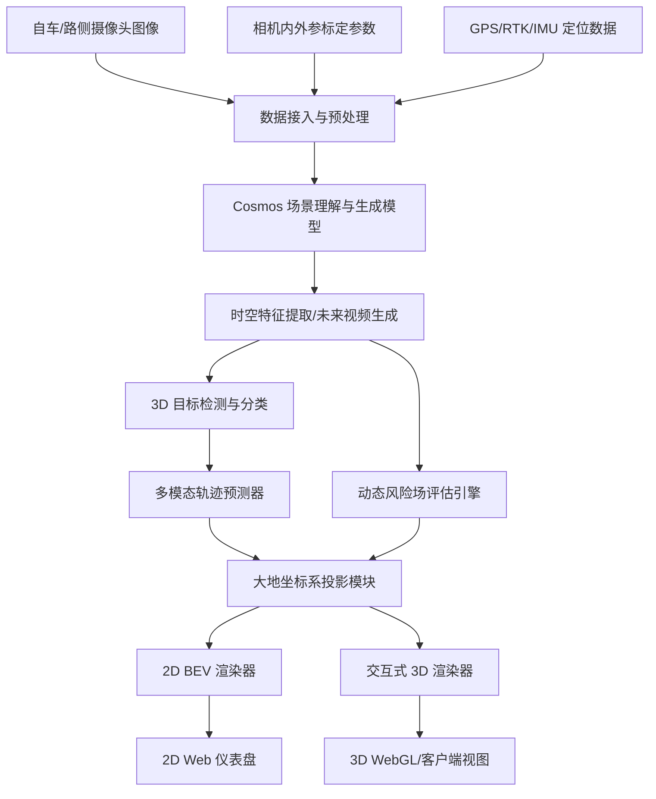
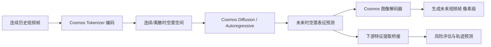

# 基于 Cosmos 模型的交通场景风险演化与轨迹预测系统设计文档

本项目旨在构建一个高精度的交通场景未来态势感知与安全决策系统。系统基于 **Cosmos 世界模型**，通过自车驾驶员视角（Ego-view）或路侧摄像头视角（ITS-view）输入图像，在大地坐标系（WGS-84/UTM）下实现未来若干秒的**动态风险温度图（Risk Heatmap）**预测与**多模态交通参与者轨迹及概率（Trajectory Probability）**的可视化。系统架构支持低延迟的 2D 鸟瞰图（BEV）和交互式 3D 场景渲染。

---

## 1. 系统总体架构与数据流

本系统由数据接入、核心算法、投影转换、可视化渲染四个核心层级组成。

### 1.1 系统架构图



### 1.2 数据流描述
1. **输入阶段**：实时接收摄像头视频流、相机传感器标定矩阵、高精度定位数据（GNSS/IMU/RTK）。
2. **场景预测（Cosmos Core）**：Cosmos 模型对场景的物理规律进行建模，预测未来 $T$ 秒内场景的语义、深度及物理状态演化。
3. **感知与预测（Perception & Prediction）**：
   - 提取各时间戳下静态障碍物（标识标线、护栏、树木）和动态交通参与者（车辆、行人、骑行者）的位置。
   - 对动态参与者进行多模态轨迹预测，并为每条轨迹估算概率与时空协方差。
   - 对整场空间进行多源信息融合，评估未来的动态风险势能场。
4. **空间投影（Projection）**：利用逆透视变换（IPM）、单目深度或三维重建结果，将图像坐标系中的像素级预测和轨迹数据，统一投影至大地坐标系（如 UTM 投影网格）。
5. **渲染展示（Rendering）**：在 2D 鸟瞰图及 3D 交互界面中，平滑渲染风险温度图、轨迹概率隧道和目标状态。

---

## 2. 坐标系定义与空间投影算法

为保证数据在大地坐标系（Geodetic Coordinate System）下的绝对地理对齐，必须严格定义各坐标系并建立换算关系。

### 2.1 坐标系定义

| 坐标系 | 符号 | 描述 |
| :--- | :--- | :--- |
| **图像像素坐标系** | $ICS$ | 二维像素平面，原点位于图像左上角，单位：像素（pixel）。 |
| **相机坐标系** | $CCS$ | 三维坐标系，原点位于相机光心，Z轴指向相机前方，X轴右，Y轴下。 |
| **车身/路侧坐标系** | $VCS$ / $RCS$ | 三维直角坐标系。自车：原点为后轴中心投影至地面，X前、Y左、Z上（ISO标准）。路侧：原点为立杆底部。 |
| **大地坐标系** | $GCS$ | WGS-84（经度 Longitude, 纬度 Latitude, 海拔 Altitude），为保证计算便利，通常转换为 **UTM 投影直角坐标系**（单位：米）。 |

### 2.2 空间投影换算公式

#### 2.2.1 像素到相机的逆投影
对于像素点 $(u, v)$，若其预测深度为 $d$，则其在相机坐标系下的三维坐标 $\mathbf{X}_c = [X_c, Y_c, Z_c]^T$ 计算为：
$$X_c = \frac{(u - u_0) \cdot d}{f_x}$$
$$Y_c = \frac{(v - v_0) \cdot d}{f_y}$$
$$Z_c = d$$
其中 $f_x, f_y, u_0, v_0$ 为相机内参矩阵 $\mathbf{K}$ 的参数：
$$\mathbf{K} = \begin{bmatrix} f_x & 0 & u_0 \\ 0 & f_y & v_0 \\ 0 & 0 & 1 \end{bmatrix}$$

#### 2.2.2 相机坐标系到车身/路侧直角坐标系
利用外参矩阵（旋转矩阵 $\mathbf{R}_{c\to v}$，平移向量 $\mathbf{T}_{c\to v}$）：
$$\mathbf{X}_v = \mathbf{R}_{c\to v} \mathbf{X}_c + \mathbf{T}_{c\to v}$$

#### 2.2.3 车身/路侧坐标系到全球地理坐标系（UTM）
通过高精度定位系统获取的自车/路侧设备在 WGS-84 下的绝对坐标和姿态角（航向角 Yaw $\psi$，俯仰角 Pitch $\theta$，横滚角 Roll $\phi$），构建车身坐标系到 UTM 坐标系的变换矩阵 $[\mathbf{R}_{v\to utm} | \mathbf{T}_{v\to utm}]$：
$$\mathbf{X}_{utm} = \mathbf{R}_{v\to utm} \mathbf{X}_v + \mathbf{T}_{v\to utm}$$
由此，视频帧中的任何像素、边界框或运动轨迹皆可投影至绝对的地理坐标系中。

> [!IMPORTANT]
> **路侧相机无实时定位时的处理方案**
> 对于固定路侧摄像头（ITS），定位数据在安装时一次性标定写入（静态内外参 + 固定 GPS 点位），转换矩阵在运行期间保持恒定，仅需利用标定工具进行初始化即可。

---

## 3. Cosmos 世界模型集成方案

**NVIDIA Cosmos** 是用于物理 AI 的先进世界模型开发平台。系统集成 Cosmos 重点在于其**物理规律模拟、时空潜在表征学习**和**高保真度视频预测**能力。



### 3.1 Cosmos 的双轨预测机制

设计中提供两套实现方案以适配不同算力和实时性要求：

1. **生成式物理模拟轨（Pixel-Level Forecasting）**：
   - 使用 Cosmos Diffusion/Autoregressive 模型，根据输入的前 $N$ 帧图像，自回归生成未来第 $t+1$ 到 $t+T$ 秒的视觉预测图像。
   - 将预测的视觉图像序列送入轻量级感知网络，提取未来每个时刻的交通参与者检测框、车道线边界。
   - **优点**：可视化直观，可以直观地向用户展示“世界模型预测的未来车流画面”。
2. **潜空间特征预测轨（Latent-Level Forecasting）**：
   - 使用 Cosmos Tokenizer 将视频帧压缩至时空潜空间（Spatiotemporal Latent Space）。
   - 在潜空间中利用 Transformer 预测未来状态的潜表征 $\mathbf{z}_{t+1:t+T}$。
   - 直接从预测的潜特征解码出轨迹分布和风险概率场，跳过昂贵的图像生成步骤。
   - **优点**：推理速度快，适合实时（Real-time）车载或边缘路侧计算。

---

## 4. 风险温度图（Risk Heatmap）算法与平滑过渡设计

风险温度图旨在清晰指出未来若干秒内不同地理位置的潜在危险度，为自车规划或路侧预警系统提供防碰撞决策支持。

### 4.1 动态风险的数学定义

空间中某点 $\mathbf{x} = [x, y]^T$ 在预测未来时刻 $t$ 的总风险 $R(\mathbf{x}, t)$ 是所有交通参与者及障碍物所产生的风险场（Risk Field）的叠加：
$$R(\mathbf{x}, t) = R_{static}(\mathbf{x}) + \sum_{i=1}^{M} R_{dynamic}^i(\mathbf{x}, t)$$

#### 静态风险 $R_{static}(\mathbf{x})$
由车道线约束、限速牌、固定护栏、施工区域决定。例如，车辆偏离车道线或者驶入逆行区域，该处的静态风险值会常态化偏高。

#### 动态风险 $R_{dynamic}^i(\mathbf{x}, t)$
第 $i$ 个交通参与者带来的风险由其运动状态、类型和预测不确定性决定，采用**双变量不对称高斯分布场（Asymmetric Bivariate Gaussian Field）**来建模：
$$R_{dynamic}^i(\mathbf{x}, t) = A_i(t) \cdot \exp \left( -\frac{1}{2} (\mathbf{x} - \boldsymbol{\mu}_i(t))^T \boldsymbol{\Sigma}_i(t)^{-1} (\mathbf{x} - \boldsymbol{\mu}_i(t)) \right)$$
其中：
- $\boldsymbol{\mu}_i(t) = [x_i(t), y_i(t)]^T$ 为交通参与者 $i$ 在 $t$ 时刻的预测中心位置。
- $A_i(t)$ 为风险幅值，根据目标类型（大卡车 > 行人 > 自行车）、速度大小以及与自车的碰撞时间（TTC）成反比动态计算。
- $\boldsymbol{\Sigma}_i(t)$ 为协方差矩阵，用于控制风险场的空间扩散范围与方向。

```
                    ▲ (运动方向 v)
                    │
               .---------.
             .     :     .  (行进方向上扩散范围更大)
            .      :      .
           .       o       .  <-- 目标中心位置 μ_i(t)
            .    (侧向)   .
             .           .
               '-------'
```

为了体现运动的前向风险远大于后向风险，协方差矩阵的参数沿运动方向进行非对称拉伸：
- 在目标行进方向的前方，标准差 $\sigma_{forward}$ 随着速度 $v$ 的增大而增大：$\sigma_{forward} = \sigma_{base} + k \cdot v^2$。
- 在侧向，标准差 $\sigma_{lateral}$ 保持常数或较小变化。
- 在后方，标准差 $\sigma_{backward}$ 设为极小值。

### 4.2 概率平滑过渡与插值方法
为避免热力图中出现斑点状突变，系统在 UTM 网格上执行以下平滑策略：
1. **网格化表征**：将目标区域划分为 $0.2m \times 0.2m$ 的空间网格。
2. **高斯核卷积**：计算每个网格中心的风险值后，使用时空连续高斯核进行核密度估计（KDE）平滑。
3. **时间轴插值**：对相邻预测时刻（如 $t=1.0s$ 到 $t=2.0s$）的风险网格进行双线性时间插值，使得播放预测演化时温变过程流畅无跳跃。

### 4.3 颜色映射规范 (Color Mapping)
系统采用 HSL 颜色空间进行色彩插值，以确保色彩过渡的视觉平滑度和警示性：

| 风险等级 | 风险值区间 | HSL 颜色配置 | 视觉隐喻 |
| :--- | :--- | :--- | :--- |
| **极高风险 (Critical)** | $[0.8, 1.0]$ | `hsl(0, 100%, 50%)` 到 `hsl(20, 100%, 50%)` | 纯红至深橙，警示碰撞危险 |
| **中度风险 (Warning)** | $[0.4, 0.8)$ | `hsl(30, 100%, 50%)` 到 `hsl(60, 100%, 50%)` | 橙黄至明黄，警示注意避让 |
| **低风险 (Safe)** | $[0.1, 0.4)$ | `hsl(120, 70%, 50%)` 到 `hsl(180, 70%, 40%)` | 浅绿至青绿，安全通道 |
| **无风险背景 (Background)**| $[0.0, 0.1)$ | `hsl(220, 60%, 20%)` | 深蓝底色（暗色调系统底色） |

*在渲染时，使用 Alpha 通道对低风险和无风险区域进行渐变透明处理，避免遮挡地图背景底纹。*

---

## 5. 轨迹预测与概率可视化设计

对于每一个检测到的动态交通参与者（Dynamic Agent），系统需要预测其在未来 $T$ 秒内多种可能的行驶路径（Mode），并提供精细的视觉表达。

### 5.1 轨迹预测表示法
每个 Agent 的预测结果包含 $K$ 条候选轨迹（例如 $K=3$，分别对应直行、左转、右转），表示为：
$$\tau_i = \{ (\tau_i^k, P_i^k) \}_{k=1}^K$$
其中：
- $P_i^k$ 为第 $k$ 条轨迹分支的预测概率，且满足 $\sum_{k=1}^K P_i^k = 1$。
- $\tau_i^k = \{ \mathbf{s}_i^k(t) \}_{t=t+1}^{t+T}$ 是一个时空点序列。
- 每个时空点包含状态 $\mathbf{s}_i^k(t) = [x_i^k(t), y_i^k(t), \theta_i^k(t), \boldsymbol{\Sigma}_{xy, i}^k(t)]$，其中 $\boldsymbol{\Sigma}_{xy, i}^k(t) = \begin{bmatrix} \sigma_x^2 & \sigma_{xy} \\ \sigma_{xy} & \sigma_y^2 \end{bmatrix}$ 为位置预测的协方差矩阵。

### 5.2 轨迹的可视化图形学设计

为直观表达轨迹的多模态概率与不确定性，设计以下三种视觉元素：

#### 方案一：动态概率漏斗隧道（Probability Funnel Tunnel）—— 推荐用于 3D 模式
- **表现形式**：沿预测轨迹绘制一条半透明的 3D 管道（Tube）或 2D 飘带（Ribbon）。
- **几何展宽（宽度代表不确定性）**：飘带在未来时刻 $t$ 的宽度，对应位置协方差矩阵 $\boldsymbol{\Sigma}_{xy}$ 在法线方向上的投影大小（如 $2\sigma$ 置信区间，包含 95.4% 的概率）。随着时间 $t$ 增加，预测难度变大，飘带会像“漏斗”一样逐渐变宽。
- **透明度/浓度（代表概率）**：飘带的整体色调浓度和透明度由轨迹概率 $P_i^k$ 决定。概率为 70% 的主要意图路径渲染为高饱和度、低透明度的色带；概率仅 10% 的异常偏转路径则渲染为近乎雾状的半透明色带。

```
                           . - - - - - - - .  (未来 t=3s, 不确定性大, 漏斗宽)
                 . - - - '                 ' - - - .
         . - - '             (主要路径)             ' - - .
        (=========:=================================:========)  <-- 预测轨迹线
         ' - - .                                   . - - '
                 ' - - . _                 _ . - - '
                           ' - - - - - - - '  (当前 t=0s, 不确定性小, 漏斗窄)
```

#### 方案二：多分支时空脉冲粒子流（Temporal Pulse Particles）—— 推荐用于动态演示
- **表现形式**：在轨迹中心线上渲染流动的发光粒子。
- **运动动效**：粒子流动的速度与交通参与者在该时间段的实际预测车速成正比。若车辆预测在红绿灯前减速停止，粒子流动会逐渐变慢并聚集在停止线。
- **粒子密度**：粒子密度与概率 $P_i^k$ 挂钩。高概率轨迹上的粒子密集且明亮；低概率分支上的粒子稀疏暗淡。

#### 方案三：时空中置信椭圆环（Uncertainty Ellipse Rings）—— 推荐用于 2D BEV 模式
- **表现形式**：在预测轨迹的特定时间节点（如 $+1s$, $+2s$, $+3s$）绘制二维置信椭圆环。
- **计算逻辑**：
  - 椭圆的长半轴 $a$、短半轴 $b$ 分别为协方差矩阵特征值的平方根乘以置信因子 $\chi$（如 $1\sigma \Rightarrow \chi=1.52$）。
  - 椭圆的旋转角 $\theta_{ellipse}$ 由特征向量的方向决定：
    $$\theta_{ellipse} = \frac{1}{2} \arctan2(2\sigma_{xy}, \sigma_x^2 - \sigma_y^2)$$
  - 椭圆环上标注时间数字标签（例如：`1s`, `2s`, `3s`），辅助操作员直接肉眼判定危险交汇点的时间差。

---

## 6. 2D & 3D 交互式可视化界面设计

系统包含 2D BEV 综合态势感知看板，以及未来可平滑升级的 3D 交互式可视化渲染器。

### 6.1 2D 鸟瞰图 (BEV) 仪表盘设计
2D 界面致力于提供扁平化、高信息密度的战术监视视图。

```
+-----------------------------------------------------------------------------+
| [CosmosWAM] 交通风险预测系统 - 2D BEV 看板                 [系统运行状态: 良好] |
+------------------------+----------------------------------------------------+
|  [场景信息]            |                 (北 N)                             |
|  视角: 路侧主摄-03      |                   ▲                                |
|  位置: 世纪大道交叉口  |                   │                                |
|  FPS: 30 / Latency:45ms|      .----------------------------.                |
|                        |     /  │  │   [Pedestrian]     │  │\              |
|  [控制面板]            |    /   │  │       (o)          │  │ \             |
|  - 预测时长: [5.0s]    |   /    │  │      : : (轨迹)     │  │  \            |
|  - 风险阈值: [0.60]    |  /     │  │     :   :          │  │   \           |
|  - 图层显示:           | /      │  │    :     :         │  │    \          |
|    [x] 风险热力图      |/       │  │   (高风险红区)      │  │     \         |
|    [x] 轨迹预测线      |--------+--+--------------------+--+------|         |
|    [ ] 地图卫星底图    |\       │  │   (  -  -  -  )    │  │     /         |
|                        | \      │  │                    │  │    /          |
|  [参与者列表]          |  \     │  │     [Ego-Vehicle]  │  │   /           |
|  > ID-102 (小汽车) 95% |   \    │  │       [■■■]        │  │  /            |
|    - 意图: 直行(90%)   |    \   │  │       │   │        │  │ /             |
|  > ID-103 (行人)  85%  |     \  │  │       ▼   ▼        │  │/              |
|    - 意图: 横穿(75%)   |      '----------------------------'                |
|                        |                                                    |
+------------------------+----------------------------------------------------+
| [警告日志] [18:15:32] 行人 ID-103 预计在 2.4s 后与直行车辆存在碰撞风险，评级:高风险    |
+-----------------------------------------------------------------------------+
```

#### 设计要素：
1. **背景图层**：采用矢量化高精地图（HD Map）图层，车道线用细灰线表示，人行横道用虚线表示。背景使用深灰偏蓝色调（例如 `#121620`），以突显彩色图层。
2. **风险热力图图层**：覆盖在道路网格上，使用高斯平滑的 Alpha 混合图层，不透明度设为 $0.5$ 左右，确保下方的车道线清晰可见。
3. **动态轨迹图层**：交通参与者中心点延伸出虚线轨迹，末端发散呈“漏斗状”半透明阴影。

---

### 6.2 交互式 3D 渲染器设计 (Web 3D & 引擎版)
3D 交互支持用户在多维空间中漫游，并直观观察立体的时空预测模型。

#### 技术栈建议：
- **Web 端**：Three.js / WebGL / Babylon.js，配合 React Three Fiber (R3F) 实现声明式组件开发。
- **桌面/车载终端**：Unreal Engine 5 (UE5) 或 Unity，以获得影视级光影和极佳的物理碰撞检测表现。

#### 3D 交互核心机制：
1. **多视角无缝切换**：
   - **自车第一人称 (Ego FP)**：模拟驾驶员真实视野，在前挡风玻璃上通过 AR 投影渲染红黄绿相间的“地面风险指引带”。
   - **鸟瞰视角 (BEV Mode)**：正投影俯视视角，可进行无级缩放（Zoom）和平移。
   - **上帝交互视角 (Free Orbit Mode)**：用户可通过鼠标拖拽旋转、平移，从任意侧向夹角观察立体场景。
2. **立体时空风险体积（Spatiotemporal Risk Volume）**：
   - 不仅在地面渲染 2D 风险图，还可将风险表达为 3D 网格（例如在车辆周围环绕着立体的“风险保护气泡”或“势能场柱状体”），气泡的大小随速度动态膨胀。
3. **3D 轨迹管道（3D Trajectory Tubes）**：
   - 将轨迹渲染为三维发光管道。
   - 管道的纵剖面宽度展示空间不确定性，管道的高度或内部流动粒子的波动频率指示速度信息。
   - 提供 3D 悬浮意图浮标（Floating Label Billboard），紧随车辆移动，显示其 ID、类型、车速以及意图概率。

---

## 7. 数据接口规范 (API Schemas)

为了确保核心模型与 2D/3D 可视化前端解耦，定义以下标准的 JSON 数据接口规范。

### 7.1 输入接口 Schema (感知输入)
该数据由传感器或数据集解析器实时发往系统算法后台。

```json
{
  "timestamp": 1782782132000,
  "frame_id": 10425,
  "source_type": "ITS_CAMERA", 
  "device_id": "ITS-EAST-CROSS-03",
  "ego_pose": {
    "longitude": 121.506372,
    "latitude": 31.238914,
    "altitude": 4.5,
    "heading": 120.5,
    "utm_zone": "51N",
    "utm_x": 357600.25,
    "utm_y": 3457200.80
  },
  "camera_calibration": {
    "intrinsic": [
      [1153.2, 0.0, 960.0],
      [0.0, 1153.2, 540.0],
      [0.0, 0.0, 1.0]
    ],
    "extrinsic": [
      [0.999, -0.01, 0.02, 1.5],
      [0.01, 0.998, -0.05, 0.8],
      [-0.02, 0.05, 0.998, 2.1],
      [0.0, 0.0, 0.0, 1.0]
    ]
  },
  "image_base64": "/9j/4AAQSkZJR..."
}
```

---

### 7.2 输出接口 Schema (预测与风险结果)
该数据由算法后台产生，发送给 2D/3D 可视化前端进行渲染绘制。

```json
{
  "timestamp": 1782782132000,
  "frame_id": 10425,
  "prediction_horizon_seconds": 5.0,
  "geodetic_reference": {
    "projection": "UTM",
    "zone": "51N"
  },
  "risk_heatmap_grid": {
    "origin_utm_x": 357580.0,
    "origin_utm_y": 3457180.0,
    "resolution_meter": 0.5,
    "grid_width_cols": 80,
    "grid_height_rows": 80,
    "time_steps": [0.0, 1.0, 2.0, 3.0, 4.0, 5.0],
    "compressed_risk_values": [
      [0.01, 0.02, 0.05],
      [0.10, 0.45, 0.85]
    ]
  },
  "dynamic_objects": [
    {
      "object_id": 102,
      "type": "VEHICLE",
      "size": { "length": 4.8, "width": 1.9, "height": 1.4 },
      "current_state": {
        "utm_x": 357602.4,
        "utm_y": 3457205.1,
        "heading": 120.5,
        "velocity_mps": 12.5
      },
      "multimodal_trajectories": [
        {
          "mode_probability": 0.85,
          "description": "go_straight",
          "waypoints": [
            {
              "relative_time_seconds": 1.0,
              "utm_x": 357613.2,
              "utm_y": 3457198.8,
              "heading": 120.5,
              "covariance": [
                [0.15, 0.02],
                [0.02, 0.08]
              ]
            },
            {
              "relative_time_seconds": 2.0,
              "utm_x": 357624.0,
              "utm_y": 3457192.5,
              "heading": 120.5,
              "covariance": [
                [0.45, 0.08],
                [0.08, 0.22]
              ]
            }
          ]
        },
        {
          "mode_probability": 0.15,
          "description": "turn_right",
          "waypoints": [
            {
              "relative_time_seconds": 1.0,
              "utm_x": 357611.8,
              "utm_y": 3457196.2,
              "heading": 135.0,
              "covariance": [
                [0.25, 0.05],
                [0.05, 0.15]
              ]
            }
          ]
        }
      ]
    }
  ]
}
```

---

## 8. 开发路线图与技术选型建议

为保证系统的高效落地，建议分四个阶段推进研发：

### 阶段一：算法验证与离线 2D 可视化（第 1-3 个月）
- **核心任务**：搭建基于 Python 的 Cosmos 世界模型推理 pipeline，打通单目深度及目标检测；编写基础 of 基于 OpenCV/Matplotlib 的 2D 风险网格渲染脚本。
- **技术栈**：Python, PyTorch, NVIDIA Cosmos SDK, OpenCV, NumPy.

### 阶段二：实时 API 规范制定与 2D Web 交互看板（第 4-6 个月）
- **核心任务**：封装 Python 算法模型为 gRPC/WebSocket 服务；开发 Web 端 2D 态势感知看板，支持实时渲染风险温度图及多分支轨迹线。
- **技术栈**：FastAPI (gRPC / WebSockets), React.js, TailwindCSS, HTML5 Canvas / Pixi.js (高性能 2D 渲染引擎).

### 阶段三：3D 交互场景重构与功能级集成（第 7-9 个月）
- **核心任务**：基于 Three.js 搭建 Web 3D 渲染系统，引入相机标定参数自动投射，实现 3D 概率隧道、脉冲粒子轨迹流与 3D 悬浮看板。
- **技术栈**：Three.js, React Three Fiber (R3F), GLSL (自定义着色器实现平滑温度图渲染).

### 阶段四：实车/路侧实机部署与闭环测试（第 10-12 个月）
- **核心任务**：集成 RTK 绝对定位，进行多天气、多时段路测，并评估风险图的时空计算延迟（目标全栈时延 < 80ms）。
- **技术栈**：C++, ROS2 (Robot Operating System), TensorRT (模型加速推理), WebGL.
