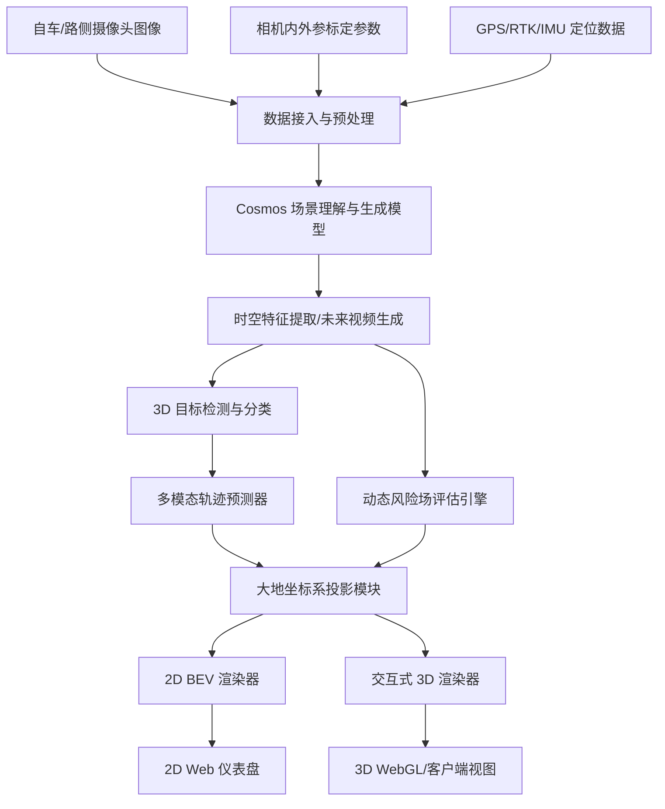
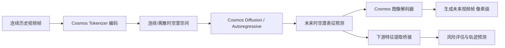
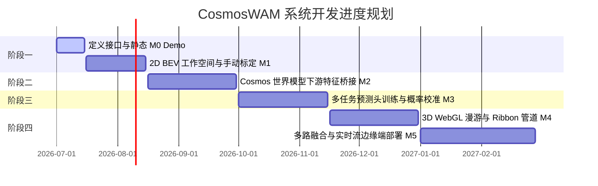

# 基于 Cosmos 模型的交通场景风险演化与轨迹预测系统设计文档 (综合优化版)

| 版本 | 日期 | 作者/状态 | 适用阶段 |
| :--- | :--- | :--- | :--- |
| **v1.0 (最终版)** | 2026-06-30 | 系统架构组 / 评审通过 | 详细设计、算法研发、接口对接、可视化开发 |

---

## 1. 文档目标与系统定义

### 1.1 文档目标
本文档旨在为基于 **Cosmos 世界模型** 的交通场景未来风险趋势预测系统（以下简称 **CosmosWAM**）提供一份详尽的、生产级别的系统设计方案。本文档整合了产品定义、系统架构、空间投影与风险计算数学推导、可视化图形学设计、API 接口、模型训练与评估指标等模块，作为后续算法拆分、前后端协同开发以及工程落地的唯一参考基准。

### 1.2 产品一句话定义
**CosmosWAM** 是一个面向交通场景的世界模型风险预测与可视化系统：输入单张/一段交通场景视觉图像（支持自车视角与路侧视角），系统预测未来若干秒在大地坐标系下的动态风险温度图、交通参与者多模态概率轨迹、关键风险成因解释，并提供直观的 2D 鸟瞰图（BEV）和可交互式 3D 场景展示。

---

## 2. 背景、核心设想与设计原则

### 2.1 背景与 Cosmos 世界模型的定位
交通场景风险不仅是单一瞬间的目标检测问题，而是一个包含空间约束、时间演化、交通语义和参与者交互行为的复杂动态演推过程。传统的感知系统只能输出“当前有什么”，无法回答“未来会怎样、危险在哪里”。

**NVIDIA Cosmos** 作为面向 Physical AI 的世界基础模型，具备极强的物理世界规律模拟、视觉潜在表征学习以及视频生成预测能力。在本系统中，**Cosmos 并非直接作为面向用户的终端产品，而是定位为底层的基础推演引擎**。我们通过接入 Cosmos 的时空潜特征（Spatiotemporal Latents）或生成的预测视频序列，在其上构建交通风险专用预测头、高精度坐标变换模块、概率校准模块与可视化系统，实现时空连续的风险度量。

### 2.2 典型使用场景
1. **自车视角风险预测（Ego-view）**：输入车辆前视摄像头画面，预测未来 1-8 秒内自车周边风险（如前车急刹、行人横穿、非机动车切入、道路施工等）。
2. **路侧摄像头风险预测（ITS-view）**：输入路口/路侧摄像头画面，将像素坐标映射到大地坐标系，预测交叉路口冲突点、行人过街风险、盲区/遮挡造成的未知潜在风险。
3. **事故隐患离线分析**：对历史记录图片或视频进行离线批处理，自动定位冲突高发点，生成风险热力图序列与安全评估报告。

### 2.3 核心设计原则
* **绝对空间对齐**：所有感知与预测结果必须统一投影至大地坐标系（WGS-84/UTM）或局部 ENU 坐标系中，拒绝只停留在 2D 像素面。
* **显式不确定性表达**：未来具有多模态不确定性，系统必须输出多分支轨迹概率、空间位置协方差以及网格化的风险概率值，而非单一确定性结果。
* **时空序列推演**：风险是连续变化的物理场，系统输出必须以时间轴（如 $t+0.5s, t+1.0s, \dots, t+5.0s$）的时空网格序列进行表达。
* **直觉与调试双重设计**：UI 可视化既要通过颜色温标让非技术人员一眼看懂危险区域，又要通过置信椭圆、模式概率等数据满足研发人员的调试需求。

---

## 3. 系统总体架构与数据流

### 3.1 总体架构图
系统由数据接入、核心算法、投影转换、可视化渲染四个核心层级组成。



### 3.2 Cosmos 的双轨集成机制
系统根据算力与延迟要求，提供两条并行的模型集成方案：



1. **生成式物理模拟轨（Pixel-Level Forecasting）**：利用 Cosmos 预测生成未来 $T$ 秒的视觉预测图像序列，再送入轻量级感知网络提取目标边界框与道路约束。**优点**：生成画面直观，方便人工核验物理推演是否合理。
2. **潜空间特征预测轨（Latent-Level Forecasting）**：将输入帧通过 Cosmos Tokenizer 压缩至时空潜特征，在潜空间中利用 Transformer 推演未来特征演化，直接接轻量级多任务头解码出轨迹概率与风险场。**优点**：省去图像解码开销，推理延迟极低，适配实时车载与路侧边缘端部署。

---

## 4. 坐标系定义与空间投影算法（数学推导）

### 4.1 坐标系定义
* **图像像素坐标系（$ICS$）**：二维平面，原点在图像左上角，横轴 $u$，纵轴 $v$，单位：`pixel`。
* **相机坐标系（$CCS$）**：三维直角坐标系，原点在相机光心，Z轴指向相机前方，X轴向右，Y轴向下，单位：`meter`。
* **车身/路侧坐标系（$VCS$ / $RCS$）**：三维直角坐标系。自车系统：原点为后轴中心投影至地面，X前、Y左、Z上（ISO标准）。路侧系统：原点为立杆根部投影至地面。
* **大地坐标系（$GCS$）**：全球 WGS-84（经度 Longitude, 纬度 Latitude, 海拔 Altitude）。
* **局部东-北-天坐标系（$ENU$）**：以场景中心/相机基点为原点，东向为X，北向为Y，垂直向上为Z。

### 4.2 空间投影换算关系

#### 4.2.1 像素到相机坐标系的逆投影
对于像素点 $(u, v)$，若其深度预测值为 $d$，则其相机坐标系下的三维坐标 $\mathbf{X}_c = [X_c, Y_c, Z_c]^T$ 为：
$$X_c = \frac{(u - u_0) \cdot d}{f_x}$$
$$Y_c = \frac{(v - v_0) \cdot d}{f_y}$$
$$Z_c = d$$
其中，内参矩阵 $\mathbf{K}$ 为：
$$\mathbf{K} = \begin{bmatrix} f_x & 0 & u_0 \\ 0 & f_y & v_0 \\ 0 & 0 & 1 \end{bmatrix}$$

#### 4.2.2 相机坐标系到车身/路侧坐标系
利用相机安装外参（旋转矩阵 $\mathbf{R}_{c\to v} \in \mathbb{R}^{3\times 3}$，平移向量 $\mathbf{T}_{c\to v} \in \mathbb{R}^{3\times 1}$）：
$$\mathbf{X}_v = \mathbf{R}_{c\to v} \mathbf{X}_c + \mathbf{T}_{c\to v}$$

#### 4.2.3 车身/路侧坐标系到局部 ENU 及绝对全球坐标系（UTM）
通过高精度 RTK/GPS 获取的原点绝对地理位置，以及 IMU 获取的航向角（Yaw $\psi$）、俯仰角（Pitch $\theta$）、横滚角（Roll $\phi$），构建变换矩阵 $[\mathbf{R}_{v\to utm} | \mathbf{T}_{v\to utm}]$：
$$\mathbf{X}_{utm} = \mathbf{R}_{v\to utm} \mathbf{X}_v + \mathbf{T}_{v\to utm}$$
在大地坐标系投影后，将绝对坐标统一平移至场景原点 $\mathbf{X}_{origin}$，转换为利于局部网格计算的 ENU 坐标：
$$\mathbf{X}_{enu} = \mathbf{X}_{utm} - \mathbf{X}_{origin}$$

> [!IMPORTANT]
> **无高精定位与单目情况下的空间退化处理**
> 1. **单目深度逆映射（IPM）**：若无激光雷达或稠密深度估计，系统将假设地面局部平坦，利用单应性矩阵（Homography）$\mathbf{H}$ 将像素坐标投影至地面 $\mathbf{X}_{enu} = \mathbf{H} [u, v, 1]^T$。
> 2. **路侧静态标定**：对于固定路侧摄像头，GPS 坐标与姿态角在安装时一次性静态写入，运行中转换矩阵保持恒定。
> 3. **空间置信度传播**：单目逆映射随距离增加误差呈指数上升。映射到世界坐标的每个对象应包含空间协方差 $\boldsymbol{\Sigma}_{pos}$，并在后续轨迹和风险热力图计算中作为不确定度源传播。

---

## 5. 风险热力图（Risk Heatmap）算法与平滑设计

### 5.1 动态风险的数学定义与非对称高斯场
空间中某点 $\mathbf{x} = [x, y]^T$ 在预测未来时刻 $t$ 的总风险 $R(\mathbf{x}, t)$ 是静态地图约束与动态交通参与者风险场的融合：
$$R(\mathbf{x}, t) = \mathbf{Clip}\left( R_{static}(\mathbf{x}) + \sum_{i=1}^{M} R_{dynamic}^i(\mathbf{x}, t), \; 0, \; 1 \right)$$

#### 5.1.1 静态风险场 $R_{static}(\mathbf{x})$
由道路拓扑决定。若车辆偏离行驶车道、驶入逆行区或实体障碍物区，该坐标的静态风险趋近于 $1.0$。

#### 5.1.2 动态风险场 $R_{dynamic}^i(\mathbf{x}, t)$
第 $i$ 个动态交通参与者在 $t$ 时刻对坐标 $\mathbf{x}$ 产生的风险值采用**非对称双变量高斯分布（Asymmetric Bivariate Gaussian Field）**进行建模：
$$R_{dynamic}^i(\mathbf{x}, t) = A_i(t) \cdot \exp \left( -\frac{1}{2} (\mathbf{x} - \boldsymbol{\mu}_i(t))^T \boldsymbol{\Sigma}_i(t)^{-1} (\mathbf{x} - \boldsymbol{\mu}_i(t)) \right)$$
其中：
* $\boldsymbol{\mu}_i(t) = [x_i(t), y_i(t)]^T$ 为该目标在 $t$ 时刻的预测中心坐标。
* $A_i(t)$ 为风险幅值，根据目标类型（大卡车 > 行人 > 自行车）、速度 $v$ 及其与自车的预计碰撞时间（TTC）成反比动态计算。
* 协方差矩阵 $\boldsymbol{\Sigma}_i(t)$ 控制风险在空间的扩散范围。为了体现**车辆行进方向（前向）风险远大于后向**的物理特性，我们将标准差沿运动方向进行拉伸：

```
                    ▲ (运动方向 v)
                    │
               .---------.
             .     :     .  (前向拉伸距离较大: σ_forward)
            .      :      .
           .       o       .  <-- 目标中心位置 μ_i(t)
            .    (侧向)   .
             .           .
               '-------'
```

以目标当前航向角 $\theta$ 构建旋转矩阵 $\mathbf{R}(\theta)$，将局部对角标准差矩阵 $\boldsymbol{\Sigma}_{local}$ 旋转至 ENU 世界坐标系：
$$\boldsymbol{\Sigma}_i(t) = \mathbf{R}(\theta) \begin{bmatrix} \sigma_{x, local}^2 & 0 \\ 0 & \sigma_{y, local}^2 \end{bmatrix} \mathbf{R}(\theta)^T$$
其中局部标准差分段定义为：
* **前向（$y_{local} \ge 0$）**：$\sigma_{y, local} = \sigma_{forward} = \sigma_{base} + k_{front} \cdot v_i(t)^2$ （与车速正相关）。
* **后向（$y_{local} < 0$）**：$\sigma_{y, local} = \sigma_{backward} = \sigma_{base}$ （保持常数）。
* **侧向（$x_{local}$ 轴）**：$\sigma_{x, local} = \sigma_{lateral} = \sigma_{side} + k_{side} \cdot v_i(t)$。

### 5.2 多源风险融合机制
为了避免直接加和导致数值溢出，本系统采用**概率并集融合（Probabilistic Union Fusion）**方法：
$$R_{total}(\mathbf{x}, t) = 1 - \prod_{j} \Big(1 - w_j \cdot R_j(\mathbf{x}, t)\Big)$$
这样，当多个中等危险事件叠加时，总风险会平滑逼近 $1.0$，而不会超过边界限制。

### 5.3 空间与时间平滑插值
1. **网格化表示**：计算区域划分为 $0.2m \times 0.2m$（高精度）或 $0.5m \times 0.5m$（低延迟）的栅格网格。
2. **核密度估计平滑（KDE）**：网格风险值计算后，通过空间高斯低通滤波器卷积，避免出现噪声状突变。
3. **时间指数移动平均（Temporal EMA）**：消除相邻时间步（如间隔 $0.5s$）的瞬时跳变与闪烁：
   $$R_{smooth}(\mathbf{x}, t) = \alpha \cdot R_{raw}(\mathbf{x}, t) + (1-\alpha) \cdot R_{smooth}(\mathbf{x}, t-\Delta t)$$
4. **时间双线性插值**：渲染端播放预测动画时，在 $t_1$ 到 $t_2$ 之间进行线性插值，使色温渐变流畅无卡顿。

### 5.4 颜色映射规范 (Color Mapping)
系统采用 HSL 颜色空间做色彩连续插值，设置不透明度（Alpha 通道）渐变，避免遮挡地图底图：

| 风险值区间 | HSL 颜色配置 | 风险等级 | 视觉表达语义 |
| :--- | :--- | :--- | :--- |
| $[0.8, 1.0]$ | `hsl(0, 100%, 50%)` 至 `hsl(20, 100%, 50%)` | **极高风险 (Critical)** | 纯红至红橙。预测碰撞交汇点、逆行、盲道侵入。 |
| $[0.4, 0.8)$ | `hsl(30, 100%, 50%)` 至 `hsl(60, 100%, 50%)` | **中度风险 (Warning)** | 橙黄至明黄。近失冲突、车速过快、侵入车道边缘。 |
| $[0.1, 0.4)$ | `hsl(120, 70%, 50%)` 至 `hsl(180, 70%, 40%)` | **低风险 (Safe)** | 浅绿至青。安全行驶走廊，低碰撞概率。 |
| $[0.0, 0.1)$ | `hsl(220, 60%, 20%)` (Alpha = 0) | **无风险 (Background)** | 纯透明底色。背景地图网格。 |

---

## 6. 多模态轨迹预测与概率可视化设计

### 6.1 多模态轨迹数学表达
对于每个动态交通参与者，系统输出 $K$ 条模态轨迹（如直行、左转、变道等候选路径）：
$$\tau_i = \{ (\tau_i^k, P_i^k) \}_{k=1}^K, \quad \sum_{k=1}^K P_i^k = 1$$
单条轨迹 $\tau_i^k$ 为未来时间序列点的集合：
$$\tau_i^k = \{ [x_i^k(t), y_i^k(t), \theta_i^k(t), \boldsymbol{\Sigma}_{xy, i}^k(t)] \}_{t=t+1}^{t+T}$$
其中，$\boldsymbol{\Sigma}_{xy} = \begin{bmatrix} \sigma_x^2 & \sigma_{xy} \\ \sigma_{xy} & \sigma_y^2 \end{bmatrix}$ 为每个未来时间点位置估计的协方差矩阵。

### 6.2 轨迹概率与不确定性可视化方案

#### 方案一：动态概率漏斗隧道（Probability Funnel Tunnel）—— 用于 3D 模式
* **设计细节**：沿轨迹绘制一个半透明的 3D 管道或 2D 渐变飘带。
* **宽度控制（不确定性）**：飘带在未来时刻 $t$ 的法线方向展宽，对应位置协方差矩阵 $\boldsymbol{\Sigma}_{xy}$ 在法线方向上的投影大小（如 $2\sigma$ 置信区间，覆盖约 95.4% 的空间可能）。随着预测时间 $t$ 变大，不确定性增加，管道呈漏斗状向外膨胀。
* **浓度控制（概率）**：管道的色温饱和度及不透明度（Alpha）与概率 $P_i^k$ 成正比。高概率主要意图（如 $P=0.75$）渲染为明亮且结实的管道；低概率异常分支（如 $P=0.10$）渲染为虚弱半透明的雾状带。

#### 方案二：多分支时空脉冲粒子流（Temporal Pulse Particles）—— 用于动态动画展示
* **设计细节**：在每条轨迹中心线上渲染流动的发光微粒。
* **流动速度**：粒子的移动速度直接对应交通参与者在该时间段的预测行驶车速。若车辆即将红灯停车，粒子在停止线前会逐渐慢速并堆积。
* **粒子密度**：高概率轨迹上粒子密集、亮度大；低概率轨迹上粒子稀疏、几乎暗淡。

#### 方案三：时空置信椭圆环（Uncertainty Ellipse Rings）—— 用于 2D BEV 模式
* **设计细节**：在轨迹的整数秒节点（如 $+1s, +2s, +3s$）绘制二维不确定性置信椭圆。
* **计算逻辑**：
  长半轴 $a$、短半轴 $b$ 根据特征值 $\lambda_1, \lambda_2$ 及置信系数 $\chi$（如 $1\sigma \Rightarrow \chi=1.52$）计算：
  $$a = \chi \sqrt{\lambda_1}, \quad b = \chi \sqrt{\lambda_2}$$
  特征值计算公式：
  $$\lambda_{1,2} = \frac{\sigma_x^2 + \sigma_y^2}{2} \pm \sqrt{\left(\frac{\sigma_x^2 - \sigma_y^2}{2}\right)^2 + \sigma_{xy}^2}$$
  倾斜角度 $\theta_{ellipse}$ 由特征向量方向决定：
  $$\theta_{ellipse} = \frac{1}{2} \arctan2(2\sigma_{xy}, \sigma_x^2 - \sigma_y^2)$$
  每个椭圆旁边附带醒目的时间数字标签（如 `2.0s`），便于分析人员直观评估两车交汇的碰撞时间差。

---

## 7. 风险解释模块设计

系统除了直观渲染热力图外，还需要给出高风险成因的语义化解释，辅助做决策审计。

### 7.1 解释维度与分类
* **场景级**：对整个场景做安全评级（如“高风险”），并提炼核心危险点及出现时间。
* **热点级（Hotspot）**：解析热力图中红色极高风险栅格的成因，拆解成具体的物理事件。
* **参与者级**：标记某个参与者对当前风险的贡献率（Risk Contribution）。

### 7.2 语义化规则映射
系统根据计算出的 TTC（Time to Collision）、PET（Post-Encroachment Time）、空间距离和道路约束规则进行翻译：
* $\text{TTC} < 1.5s$且轨迹交叉 $\Rightarrow$ **“轨迹冲突”**
* 被检测遮挡区与预测车道重叠 $\Rightarrow$ **“盲区遮挡潜在冲突”**
* 轨迹越过道路边缘线 $\Rightarrow$ **“越界风险”**
* 车速大于路段限速 $\Rightarrow$ **“超速违法风险”**

---

## 8. 系统接口与 API 设计 (RESTful & JSON Schemas)

### 8.1 核心 RESTful API 设计

| API 路由 | HTTP 方法 | 请求体 | 返回体 | 描述 |
| :--- | :--- | :--- | :--- | :--- |
| `/api/scenarios` | `POST` | `multipart/form-data` (Image/Video, Meta JSON) | `{scenario_id: str, status: str}` | 上传场景图像及相机标定初始参数，创建会话 |
| `/api/scenarios/{id}/predict` | `POST` | `application/json` (预测时间步长、范围、模态数配置) | `{prediction_id: str, status: str}` | 启动 Cosmos 世界模型进行异步未来演演推演 |
| `/api/predictions/{id}` | `GET` | 无 | `{prediction_id: str, status: str, result_uri: str}` | 获取推演状态（运行中、已完成、失败） |
| `/api/predictions/{id}/risk-map` | `GET` | `?time_s=2.0` | `image/png` 或 `application/octet-stream` (npy) | 导出指定未来时间戳下的原始风险值矩阵/热力图片 |
| `/api/predictions/{id}/exports` | `POST` | `{formats: ["json", "glb", "mp4"]}` | `{export_urls: {json: str, ...}}` | 打包导出用于离线回放的可视化交互数据包 |

---

### 8.2 数据结构定义 (JSON Schemas)

#### 8.2.1 算法输入接口 JSON Schema
用于系统接收外部传感器或数据回放器发送的图像及物理参数。
```json
{
  "$schema": "http://json-schema.org/draft-07/schema#",
  "title": "CosmosWAMInput",
  "type": "OBJECT",
  "properties": {
    "timestamp": { "type": "INTEGER", "description": "毫秒级 Unix 时间戳" },
    "frame_id": { "type": "INTEGER" },
    "source_type": { "type": "STRING", "enum": ["EGO_CAMERA", "ITS_CAMERA"] },
    "device_id": { "type": "STRING" },
    "ego_pose": {
      "type": "OBJECT",
      "properties": {
        "longitude": { "type": "NUMBER" },
        "latitude": { "type": "NUMBER" },
        "altitude": { "type": "NUMBER" },
        "heading": { "type": "NUMBER", "description": "航向角，单位：度" },
        "utm_zone": { "type": "STRING" },
        "utm_x": { "type": "NUMBER" },
        "utm_y": { "type": "NUMBER" }
      },
      "required": ["longitude", "latitude", "heading", "utm_x", "utm_y"]
    },
    "camera_calibration": {
      "type": "OBJECT",
      "properties": {
        "intrinsic": {
          "type": "ARRAY",
          "items": { "type": "ARRAY", "items": { "type": "NUMBER" } },
          "description": "3x3 内参矩阵"
        },
        "extrinsic": {
          "type": "ARRAY",
          "items": { "type": "ARRAY", "items": { "type": "NUMBER" } },
          "description": "4x4 外参矩阵"
        }
      },
      "required": ["intrinsic", "extrinsic"]
    },
    "image_base64": { "type": "STRING", "description": "单帧或首帧图像的Base64编码数据" }
  },
  "required": ["timestamp", "frame_id", "source_type", "ego_pose", "camera_calibration", "image_base64"]
}
```

#### 8.2.2 算法输出接口 JSON Schema
包含预测的风险场网格、各交通参与者的多分支概率轨迹以及语义化风险解释。
```json
{
  "$schema": "http://json-schema.org/draft-07/schema#",
  "title": "CosmosWAMOutput",
  "type": "OBJECT",
  "properties": {
    "timestamp": { "type": "INTEGER" },
    "frame_id": { "type": "INTEGER" },
    "prediction_horizon_seconds": { "type": "NUMBER" },
    "geodetic_reference": {
      "type": "OBJECT",
      "properties": {
        "projection": { "type": "STRING", "enum": ["UTM", "ENU"] },
        "zone": { "type": "STRING" },
        "origin_utm_x": { "type": "NUMBER" },
        "origin_utm_y": { "type": "NUMBER" }
      },
      "required": ["projection", "origin_utm_x", "origin_utm_y"]
    },
    "risk_heatmap_grid": {
      "type": "OBJECT",
      "properties": {
        "resolution_meter": { "type": "NUMBER", "default": 0.5 },
        "grid_width_cols": { "type": "INTEGER" },
        "grid_height_rows": { "type": "INTEGER" },
        "time_steps": { "type": "ARRAY", "items": { "type": "NUMBER" } },
        "compressed_risk_values": {
          "type": "ARRAY",
          "items": { "type": "ARRAY", "items": { "type": "NUMBER" } },
          "description": "逐行主序压缩存储的二维风险矩阵序列"
        }
      },
      "required": ["resolution_meter", "grid_width_cols", "grid_height_rows", "time_steps", "compressed_risk_values"]
    },
    "dynamic_objects": {
      "type": "ARRAY",
      "items": {
        "type": "OBJECT",
        "properties": {
          "object_id": { "type": "INTEGER" },
          "type": { "type": "STRING", "enum": ["VEHICLE", "PEDESTRIAN", "BICYCLE", "UNKNOWN"] },
          "size": {
            "type": "OBJECT",
            "properties": {
              "length": { "type": "NUMBER" },
              "width": { "type": "NUMBER" },
              "height": { "type": "NUMBER" }
            }
          },
          "current_state": {
            "type": "OBJECT",
            "properties": {
              "x_m": { "type": "NUMBER" },
              "y_m": { "type": "NUMBER" },
              "z_m": { "type": "NUMBER" },
              "heading": { "type": "NUMBER" },
              "velocity_mps": { "type": "NUMBER" }
            },
            "required": ["x_m", "y_m", "heading", "velocity_mps"]
          },
          "multimodal_trajectories": {
            "type": "ARRAY",
            "items": {
              "type": "OBJECT",
              "properties": {
                "mode_probability": { "type": "NUMBER" },
                "description": { "type": "STRING" },
                "waypoints": {
                  "type": "ARRAY",
                  "items": {
                    "type": "OBJECT",
                    "properties": {
                      "relative_time_seconds": { "type": "NUMBER" },
                      "x_m": { "type": "NUMBER" },
                      "y_m": { "type": "NUMBER" },
                      "heading": { "type": "NUMBER" },
                      "covariance": {
                        "type": "ARRAY",
                        "items": { "type": "ARRAY", "items": { "type": "NUMBER" } },
                        "description": "2x2 协方差矩阵 [[Var(X), Cov(X,Y)], [Cov(X,Y), Var(Y)]]"
                      }
                    },
                    "required": ["relative_time_seconds", "x_m", "y_m", "covariance"]
                  }
                }
              },
              "required": ["mode_probability", "waypoints"]
            }
          }
        },
        "required": ["object_id", "type", "current_state", "multimodal_trajectories"]
      }
    },
    "scene_summary": {
      "type": "OBJECT",
      "properties": {
        "overall_risk_level": { "type": "STRING", "enum": ["VERY_LOW", "LOW", "MEDIUM", "HIGH", "CRITICAL"] },
        "overall_risk_score": { "type": "NUMBER" },
        "critical_time_s": { "type": "NUMBER" },
        "critical_location_xy_m": { "type": "ARRAY", "items": { "type": "NUMBER" } },
        "main_causes": {
          "type": "ARRAY",
          "items": {
            "type": "OBJECT",
            "properties": {
              "type": { "type": "STRING", "enum": ["TRAJECTORY_CONFLICT", "OCCLUSION", "RULE_VIOLATION"] },
              "probability": { "type": "NUMBER" },
              "description": { "type": "STRING" }
            }
          }
        }
      },
      "required": ["overall_risk_level", "overall_risk_score", "main_causes"]
    }
  },
  "required": ["timestamp", "frame_id", "geodetic_reference", "risk_heatmap_grid", "dynamic_objects", "scene_summary"]
}
```

---

## 9. 可视化与交互界面规划

### 9.1 2D 鸟瞰图 (BEV) 仪表盘布局
2D 看板布局采用三栏式，致力于高清晰度与调试细节展示。
```
+-----------------------------------------------------------------------------+
| [CosmosWAM] 交通风险预测系统 - 2D BEV 看板                 [系统运行状态: 良好] |
+------------------------+----------------------------------------------------+
|  [场景信息与输入]      |                 (北 N)                             |
|  视角: 路侧主摄-03      |                   ▲                                |
|  位置: 世纪大道交叉口  |                   │                                |
|  FPS: 30 / Latency:45ms|      .----------------------------.                |
|                        |     /  │  │   [Pedestrian]     │  │\              |
|  [控制面板与图层控制]  |    /   │  │       (o)          │  │ \             |
|  - 预测时长: [5.0s]    |   /    │  │      : : (轨迹)     │  │  \            |
|  - 风险阈值: [0.60]    |  /     │  │     :   :          │  │   \           |
|  - 图层显示:           | /      │  │    :     :         │  │    \          |
|    [x] 风险热力图      |/       │  │   (高风险红区)      │  │     \         |
|    [x] 轨迹预测线      |--------+--+--------------------+--+------|         |
|    [ ] 地图卫星底图    |\       │  │   (  -  -  -  )    │  │     /         |
|                        | \      │  │                    │  │    /          |
|  [参与者列表与风险]    |  \     │  │     [Ego-Vehicle]  │  │   /           |
|  > ID-102 (小汽车) 95% |   \    │  │       [■■■]        │  │  /            |
|    - 意图: 直行(90%)   |    \   │  │       │   │        │  │ /             |
|  > ID-103 (行人)  85%  |     \  │  │       ▼   ▼        │  │/              |
|    - 意图: 横穿(75%)   |      '----------------------------'                |
|                        |                                                    |
+------------------------+----------------------------------------------------+
| [警告日志] [18:15:32] 行人 ID-103 预计在 2.4s 后与直行车辆存在碰撞风险，评级:高风险    |
+-----------------------------------------------------------------------------+
```

### 9.2 3D 交互式可视化与视图漫游
3D 交互将三维物理关系还原，支持在网页端（Three.js）或仿真客户端中流畅操作：
1. **漫游控制模式**：
   * **自由轨道（Orbit）**：允许用户鼠标右键拖拽平移，左键旋转，滚轮无级缩放。
   * **相机视角锁定**：一键切换至当前视频摄像头所在的位置视点，并在 3D 空间投射出相机的锥形视域（Camera Frustum），便于验证感知盲区。
   * **自车追随（Chase）**：锁定自车车体中心，相机跟随移动。
2. **风险立体化表达**：
   * **贴地纹理模式**：把 2D 风险网格像素渲染为半透明（透明度 $0.5$）的地面着色纹理。
   * **风险高度场（Height Field）模式**：将风险数值映射到 Z 轴高度：$Z_{mesh} = R(\mathbf{x}, t) \times H_{max}$。高风险区域在地面上凸起形成红色山峰，低风险区则是平坦的蓝色盆地。
3. **3D 轨迹展示**：
   * 采用 3D Ribbon（带状飘带）展示未来轨迹，使用特征向量计算值在水平面将飘带宽度拉伸，以立体包络管表达协方差不确定性。

### 9.3 图像视角回投影与联动
* **回投影（Re-projection）验证**：在展示 2D BEV 的同时，保留一个小窗口展示原始图像。将预测出的三维坐标、轨迹线逆投影至原图像素上，验证标定是否存在漂移，以及检测框是否对齐。
* **双向联动**：点击 2D BEV 中的任一目标，小窗口原图自动高亮框选该参与者；在 3D 界面点击红色风险区，时间轴自动滑动至该风险风险最高的时间步。

---

## 10. 系统目录结构与前后端技术选型

### 10.1 系统文件目录树建议
```text
CosmosWam/
  docs/
    cosmos_wam_design_final.md   # 本设计文档
  data/                          # 离线数据存储
    input/                       # 输入图片与标定参数
    processed/                   # 中间特征及标定输出
    outputs/                     # 导出的JSON、网格图及视频
  src/                           # 算法与后端服务
    cosmoswam/
      api/                       # RESTful / WebSocket 控制接口
      config/                    # 模型与坐标系全局参数
      geometry/                  # 内外参投影与 UTM/ENU 转换计算
      models/                    # Cosmos Backbone 接口与推理封装
      perception/                # 3D检测与静态车道线提取
      prediction/                # 多模态轨迹预测头
      risk/                      # 非对称高斯核与并集融合引擎
      utils/                     # 图像处理与日志
  web/                           # 可视化前端
    src/
      components/                # 2D Canvas/3D WebGL 组件
      layers/                    # 热力图层、车辆图层、车道线图层
      stores/                    # 状态管理（Zustand/Redux）
      api/                       # 接口层
  tests/                         # 单元测试与集成测试
  scripts/                       # 部署与快捷脚本
    calibrate.py                 # 相机手动四点标定脚本
    run_demo.py                  # 单图离线推理演示入口
```

### 10.2 后端算法与服务选型
* **编程语言**：Python 3.10+ （兼顾 Cosmos 模型对接与科学计算生态）。
* **基础服务框架**：**FastAPI** （支持异步非阻塞、原生 Pydantic 接口验证，支持高并发 WebSocket 推送风险流）。
* **数学与图像处理**：**NumPy, SciPy** （矩阵级非对称高斯场计算）；**OpenCV** （逆透视单应矩阵计算）；**Shapely** （矢量线交叉与多边形交叠计算）；**pyproj** （绝对 WGS-84 投影至直角 UTM 坐标系统）。
* **深度学习平台**：**PyTorch** + **TensorRT** （用于模型在边缘 GPU 卡上的推理加速）。

### 10.3 前端可视化选型
* **核心开发框架**：**React** / **Vue3** + **TailwindCSS**。
* **2D BEV 渲染器**：**Pixi.js** 或 原生 **HTML5 Canvas**。通过开启 WebGL 硬件加速绘制大范围栅格网格，确保在 60 FPS 刷新率下实现平滑色彩过渡。
* **3D 渲染器**：**Three.js** 配合 **React Three Fiber (R3F)**。采用自定义顶点着色器（GLSL Vertex/Fragment Shader）来实现贴地网格的风险温度渐变，提高渲染性能。

---

## 11. 算法模型训练、Loss 函数与概率校准

为了从概念演示迈向生产级交付，算法模块必须设计闭环的联合训练体系，确保模型输出的概率具有统计学意义。

### 11.1 多任务联合损失函数 (Multi-task Loss)
系统训练阶段通过融合轨迹预测、网格占用概率和风险值判定进行多任务学习：
$$\mathcal{L}_{total} = \alpha \mathcal{L}_{traj} + \beta \mathcal{L}_{occupancy} + \gamma \mathcal{L}_{risk} + \delta \mathcal{L}_{consistency}$$
* **轨迹损失 $\mathcal{L}_{traj}$**：采用混合高斯模型负对数似然损失（NLL of GMM）与平均位移误差（ADE/FDE）加权：
  $$\mathcal{L}_{traj} = -\sum_{k=1}^K \log P(y | x, mode=k)$$
* **占用损失 $\mathcal{L}_{occupancy}$**：使用 Focal Loss 解决道路网格中非占用区域（Safe）占比极大的正负样本不平衡问题：
  $$\mathcal{L}_{occupancy} = -\alpha_t (1 - p_t)^\gamma \log(p_t)$$
* **风险损失 $\mathcal{L}_{risk}$**：基于人工标注的高冲突事件以及 TTC 倒数判定，引入时空连续性平滑项 $\mathcal{L}_{consistency}$，约束相邻未来帧热力图的二阶导数，防止视频流输出剧烈跳变。

### 11.2 概率校准方法 (Probability Calibration)
大模型直接输出的 Softmax 值往往存在“过度自信”或“过度保守”的问题，无法直接等价于事故发生的概率。
系统在输出前需经过**保序回归（Isotonic Regression）**或 **温度缩放（Temperature Scaling）**校准层，通过在验证集上统计各个风险得分（Risk Score）区间的真实冲突率，调整输出边界。
评估校准度指标采用 **期待校准误差（ECE, Expected Calibration Error）**：
$$ECE = \sum_{m=1}^{M} \frac{|B_m|}{N} \Big| \mathbf{acc}(B_m) - \mathbf{conf}(B_m) \Big|$$
确保系统报告的 $80\%$ 风险值在统计上对应约 $80\%$ 的近失/冲突发生概率。

---

## 12. 评估指标与性能目标

### 12.1 算法与业务评估指标

| 维度 | 指标名称 | 公式/定义 | 业务目标值 |
| :--- | :--- | :--- | :--- |
| **感知性能** | 3D Detection mAP | 基于 Intersection over Union (IoU) | $\ge 75\%$ (标准路段) |
| | 投影误差 (Projection Error) | 世界坐标系下预测中心与真实 RTK 坐标的欧氏距离 | $\le 0.3m$ (10m范围内)<br>$\le 1.0m$ (30m范围内) |
| **轨迹预测** | minADE (5s) | $K=6$ 条轨迹中，与真实路径的最小平均绝对位移误差 | $\le 0.8m$ |
| | minFDE (5s) | 与真实未来终点的最小终点位移误差 | $\le 1.5m$ |
| | 碰撞一致性 (Collision Consistency) | 预测碰撞概率 $\ge 80\%$ 且实际发生冲突的召回率 | $\ge 90\%$ |
| **风险热力图**| AUROC / AUPRC | 将风险场判定为高风险与人工冲突标注的分类 ROC 曲线面积 | AUROC $\ge 0.88$ |
| | ECE (期待校准误差) | 预测风险分与统计碰撞频次之间的偏差期望 | $\le 5\%$ |
| **系统效能** | 决策定位时间 | 测试用户通过可视化看板发现最危险冲突点所需的时间 | $\le 5.0s$ |

### 12.2 性能迭代目标三阶段规划
1. **MVP 原型阶段**：支持单图离线分析，空间网格分辨率 $0.5m$，预测未来 $5.0s$（步长 $0.5s$）。单次推演总时延（包含大模型调用）控制在 $30s$ 以内，网页渲染帧率稳定在 $30$ FPS。
2. **工程研发阶段**：支持短视频输入，空间网格分辨率 $0.2m$。算法运行在单张 NVIDIA RTX 4090 上，推演总时延降低至 $3.0s - 5.0s$，支持高精地图矢量叠加，3D 漫游帧率达 $60$ FPS。
3. **实时边缘部署阶段**：支持视频流在线预测，通过 TensorRT 量化与 Cosmos 潜空间剪枝，端到端输入到可视化输出延迟 $\le 500ms$，支持车载边缘盒子（Orin Orin-NX / Thor）路侧低功耗运行。

---

## 13. 安全、审计与可信设计

### 13.1 非安全功能认证声明
**本系统的早期及研发版本（v1.0及以下）定位为决策辅助、离线隐患评估及演示平台**。其输出的风险概率及不确定性区间不可直接替代车辆的功能安全（Functional Safety, ISO 26262）闭环控制指令，亦不能直接用于任何生命安全相关的自主避障接管决策。

### 13.2 OOD (Out-of-Distribution) 异常环境检测
当外界环境超出模型训练分布时，系统必须具备主动降级和在 UI 告警的能力。OOD 检测模块会实时计算输入画面的特征置信度：
* **输入质量异常**：包括镜头污物遮挡、严重雨雪雾霾导致对比度极低、夜间强眩光致使曝光过度。
* **标定参数漂移**：当 IMU 角度或 GPS 定位精度发生抖动，系统计算空间转换置信度 $\sigma_{proj} \to 0$。
* **降级提示**：当前端检测到 OOD 触发时，风险热力图将切换为灰色网格覆盖，提示“环境超出可信推演范围，系统已降级，请人工确认标定与视界”。

### 13.3 预测审计日志规范 (Audit Log)
为保证事故隐患追溯，系统运行每次预测会写入结构化的本地审计日志：
```text
[AUDIT] Timestamp: 1782782132000 | FrameID: 10425 | ClientID: ITS-03 
[INFO] Model: cosmoswam-risk-v1.0 | CalibrationID: CAL-2026-06-29
[PERFORMANCE] Inference Latency: 320ms | GPU Memory Occ: 8.2 GB
[RESULT] Max Risk Score: 0.91 (Type: TRAJECTORY_CONFLICT) | Primary Actor: ID-102
[LOG_URI] data/outputs/predictions/pred_001_detail.json
```

---

## 14. 迭代开发路线图 (Milestones)


* **M0阶段 (静态开发)**：完成全量 JSON 数据规范定义，构造 Mock 数据跑通 2D 离线静态页面演示。
* **M1阶段 (2D看板)**：支持图片上传，完成手动 4 点地面标定与单应矩阵转换，开发 2D BEV 画板、图层开关与历史时间轴控件。
* **M2阶段 (Cosmos接入)**：搭建 Python 端推理 pipeline，打通 Cosmos 潜特征提取或预测视频帧解析，能够从预测图像生成中提取基本交通要素。
* **M3阶段 (专用模型训练)**：收集 nuScenes/CARLA 仿真数据，训练轨迹预测头与风险图生成头，编写保序回归概率校准脚本，评估并降低 ECE。
* **M4阶段 (3D开发)**：在 Three.js 中搭建 3D 地平网格，依据标定视域投射视锥，渲染不确定性飘带及立体高度山峰，支持场景数据 GLB 打包导出。
* **M5阶段 (实时流与多路融合)**：在 C++ ROS2 架构下优化标定与逆映射性能，融合相邻摄像头重叠区，完成实车/路侧实机集成。
