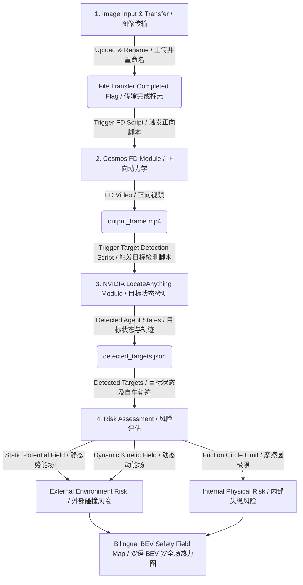

# CosmosWAM Traffic Scenario Risk Prediction System Design Document (Simplified PoC)
# CosmosWAM 交通场景风险预测系统设计文档 (简化版 PoC)

| Version | Date | Status | Target Phase |
| :--- | :--- | :--- | :--- |
| **v0.3 (Bilingual)** | 2026-06-30 | Concept Verification (PoC) | Agile Dev, Rapid Prototyping |

| 版本 | 日期 | 状态 | 适用阶段 |
| :--- | :--- | :--- | :--- |
| **v0.3 (双语对照)** | 2026-06-30 | 概念验证 (PoC) | 敏捷开发、快速原型验证 |

---

## 1. Goal and Scope / 目标与范围

This simplified document focuses on a **rapid Proof-of-Concept (PoC) prototype** leveraging Cosmos.
本简化版设计专注于构建一个基于 Cosmos 世界模型的**快速概念验证（PoC）原型**。

The system inputs a single-frame vehicle camera image, utilizes a cloud-based Cosmos **Forward Dynamics (FD)** model to simulate future environmental evolution (generating a 3-second video and predicted participant trajectories), and uses an **Inverse Dynamics (ID)** model to reconstruct the ego vehicle's motion states and longitudinal/lateral accelerations. Finally, the system computes external collision risks (via Potential and Kinetic Safety Fields) and internal physical limits (via stability friction circles) to render a 3-second dynamic BEV risk map.
系统输入车载视角的单帧图像，在云端运行 Cosmos **正向动力学（FD）**脚本推演环境变化（生成未来 3 秒视频与障碍物/自车预测轨迹），并通过**逆向动力学（ID）**解算自车的运动状态及纵横向加速度。最终，系统评估外部碰撞风险（基于势能/动能安全场）与内部物理极限（基于轮胎附着摩擦圆），绘制出 3 秒动态 BEV 驾驶安全场热力图。

---

## 2. System Architecture & Workflow / 系统总体架构与业务流

The system comprises four core modules interacting via directory watching and file exchange:
系统由四个核心模块构成，通过共享目录监听与结构化文件交互进行解耦协作：



### 2.1 Schematic ASCII Architecture Diagram / 文本架构连线图

```text
        ┌───────────────────────────────────────────┐
        │     Module 1: Image Input & Transfer      │
        └─────────────────────┬─────────────────────┘
                              │
             Outputs: [ Completion Flag, Image Path, Image Name ]
                      [   完成标记、图片路径、图片名称  ]
                              │
                              ▼
        ┌───────────────────────────────────────────┐
        │     Module 2: Forward Dynamics (FD)       │
        └─────────────────────┬─────────────────────┘
                              │
            Outputs to M3:    │ (Video Completion Flag, Video Path, Video Name)
                              │ (视频完成标记、视频路径、视频名称)
                              ▼
        ┌───────────────────────────────────────────┐
        │   Module 3: NVIDIA LocateAnything (LA)    │
        └─────────────────────┬─────────────────────┘
                              │
            Outputs to M4:    │ (Detection Completion Flag, Detection Path, Detection Name)
                              │ (检测完成标记、检测文件路径、检测文件名)
                              ▼
        ┌───────────────────────────────────────────┐
        │        Module 4: Risk Assessment          │
        └─────────────────────┬─────────────────────┘
                              │
                     Output:  ▼ [ final BEV risk map / frame_result.json ]
```

* **Data Flow Description / 数据流向说明**:
  1. **Module 1 (模块一)**: Uses configuration parameters (Image Path, Image Name, and optional Ego Pose metadata) -> Outputs completion flag, image path, and image name on the server directory once SCP is finished.
     读取本地配置参数（图片路径、文件名及可选的定位数据），利用 SCP 传输完成后，在服务器目录输出完成标记、图片路径与图片名称。
  2. **Module 2 (模块二)**: Takes Module 1 outputs -> Triggers `/home/qingxu/software/cosmos-Cosmos3/run_cosmos.sh` -> Outputs video completion flag, video path, and video name of the generated forecast video `output_frame.mp4`.
     输入模块一的完成标记、图片路径与名称。运行正向推演脚本生成预测视频 `output_frame.mp4`，并输出视频完成标记、视频路径及名称给模块三。
  3. **Module 3 (模块三)**: Watcher detects `output_frame.mp4` -> Triggers `/home/qingxu/software/cosmos-Cosmos3/run_locateAnything.sh` -> Detects target classes, positions, velocities and ego vehicle trajectory -> Outputs `detected_targets.json`.
     监听到视频生成后，调用英伟达 LocateAnything 检测脚本，对视频帧内所有障碍物目标以及自车状态进行检测，输出包含各时间步位置、航向角、速度的 `detected_targets.json` 传给模块四。
  4. **Module 4 (模块四)**: C++ client reads `detected_targets.json` -> Computes ego vehicle accelerations ($a_x, a_y$) via numerical differentiation of ego states -> Runs driving safety field and stability friction circle algorithms -> Outputs final BEV risk grid `frame_result.json`.
     客户端读取检测数据，对自车轨迹进行数值微分估算出纵横向加速度 ($a_x, a_y$)，结合障碍物轨迹状态运行驾驶安全场与摩擦圆约束计算，输出最终风险网格 `frame_result.json` 并渲染。

## 3. Detailed Module Design / 核心模块详细设计

### 3.1 Module 1: Image Input & Preprocessing Module / 模块一：图像输入与预处理模块
* **Core Function / 核心功能**: Reads local traffic image, uses SCP to upload it to the server's input directory, and triggers the downstream flow using an atomic rename mechanism to prevent read/write conflicts.
  读取本地指定的交通场景单帧图像，通过 SCP 传输安全上传至服务器输入监听目录，并利用“临时文件 + 原子重命名”机制触发传输完成信号，防止文件半写冲突。
* **Inputs / 输入内容**: None (Config parameter driven). / 无输入（由参数驱动）。
* **Configuration Parameters / 配置参数**:
  1. **Image Path / 图像路径**: Local directory of the image file. / 本地待读取图像的磁盘目录（本地磁盘物理路径）。
  2. **Image Name / 图像名称**: Local image filename (e.g., `frame.jpg`). / 本地图像文件名。
  3. **Ego Pose (Optional) / 自车定位状态（可选）**: GPS longitude, latitude, and Heading angle (Yaw), written to `metadata.json` for geodetic alignment. / 当前时刻自车的 GPS 经纬度与航向角，由客户端读取并写入元数据一同上传。
* **Outputs / 输出结果**:
  1. **File Transfer Completion Flag / 文件传输完成标志**: The presence of `frame.jpg` in `/home/user/cosmos_input/`. / 监听目录下正式出现 `frame.jpg` 文件。
  2. **Image Path / 图片路径**: Server folder directory where the image is stored. / 服务端存放该输入图片的目录路径（例如 `/home/user/cosmos_input/`）。
  3. **Image Name / 图片名称**: The uploaded image filename (e.g., `frame.jpg`). / 传输完成的图片文件名（例如 `frame.jpg`）。

---

### 3.2 Module 2: Cosmos Forward Dynamics (FD) Module / 模块二：Cosmos 正向视频生成模块
* **Core Function / 核心功能**: Triggered by Module 1's completion flag, this module calls a remote shell script `/home/qingxu/software/cosmos-Cosmos3/run_cosmos.sh` on the server `192.168.50.254` to execute the Cosmos FD world model, outputting future predicted frames as `output_frame.mp4`.
  由模块一的完成标记触发，调用远程服务器上的 shell 脚本执行 Cosmos 正向动力学模型，推演未来指定秒数的预测视频并生成 `output_frame.mp4`。
* **Inputs / 输入内容**:
  1. **File Transfer Completion Flag / 文件传输完成标志**: Trigger signal from Module 1. / 模块一完成标记（监听目录出现 `frame.jpg`）。
  2. **Image Path / 图片路径**: Server directory containing the uploaded image. / 服务端图片路径。
  3. **Image Name / 图片名称**: Server image name. / 服务端图片名称。
* **Configuration Parameters / 配置参数**:
  1. **Video Duration / 视频时长**: Prediction horizon in seconds. Default: `3.0`. / 预测时长（秒），默认 `3.0`。
  2. **Output Frame Rate / 输出帧率**: Default: `5` FPS (15 frames total for 3s). / 默认 `5` FPS。
  3. **Video Path / 视频路径**: Output directory for generated video. Default: `/home/qingxu/software/cosmos-Cosmos3/`. / 生成的视频存放目录。
  4. **Video Name / 视频名称**: Filename for generated video. Default: `output_frame.mp4`. / 生成的预测视频文件名。
* **Outputs / 输出结果**:
  1. **Video Completion Flag / 视频生成完成标记**: Presence of generated video. / 生成视频完成标记（`output_frame.mp4`）。
  2. **Video Path / 视频路径**: Saved path of the video. / 存放生成视频的目录路径。
  3. **Video Name / 视频名称**: Generated video filename (e.g., `output_frame.mp4`). / 生成的视频文件名。

---

### 3.3 Module 3: Target Detection Module (NVIDIA LocateAnything) / 模块三：目标检测模块 (NVIDIA LocateAnything)
* **Core Function / 核心功能**: Triggered by Module 2's video completion flag, this module calls a remote shell script `/home/qingxu/software/cosmos-Cosmos3/run_locateAnything.sh` on the server `192.168.50.254`. It uses LocateAnything to detect classes, coordinates, velocities, and heading angles of all traffic participants (including the ego vehicle) inside `output_frame.mp4` over time, and exports the results to `detected_targets.json`.
  由模块二的视频生成完成信号触发，运行服务器上的目标检测脚本，利用英伟达 LocateAnything 模型识别并提取预测视频中各帧的交通参与者（含自车）类别、中心坐标、速度及航向角，输出至 `detected_targets.json`。
* **Inputs / 输入内容**:
  1. **Video Completion Flag / 视频生成完成标记**: Trigger signal from Module 2. / 模块二视频完成标记（`output_frame.mp4`）。
  2. **Video Path / 视频路径**: Directory of the generated video. / 视频路径。
  3. **Video Name / 视频名称**: Video filename (e.g., `output_frame.mp4`). / 视频名称。
* **Configuration Parameters / 配置参数**: None. / 无配置参数。
* **Outputs / 输出结果**:
  1. **Detection Completion Flag / 检测完成标记**: Presence of reconstructed data. / 目标检测完成标记（`detected_targets.json`）。
  2. **Detection Result Path / 检测结果路径**: Directory containing detected targets JSON. / 检测数据文件的存储路径。
  3. **Detection Result Name / 检测结果名称**: Filename (e.g., `detected_targets.json`). / 检测数据文件名。

---

### 3.4 Module 4: Driving Safety Field & Risk Assessment Module / 模块四：时空风险态势与物理失稳评估
* **Core Function / 核心功能**: Reconstructs the local scene grid. Computes the ego vehicle's accelerations ($a_x, a_y$) via numerical differentiation of ego states over time. Estimates obstacle bounding boxes based on categories, maps out visual blind spots, computes static potential fields & dynamic kinetic fields, overlays ego friction circle limits, and generates the final BEV risk map.
  利用自车当前定位信息，通过对检测结果中的自车轨迹进行数值差分重构纵横向加速度 ($a_x, a_y$)。基于障碍物类别估算其 BEV 三维尺寸，计算视线盲区，求解车辆及静态危险源的安全场强，并结合自车轮胎附着极限计算失稳风险，最终融合输出 BEV 动态驾驶安全场图。
* **Inputs / 输入内容**:
  1. **Detection Completion Flag / 检测完成标记**: Signal from Module 3. / 模块三目标检测完成标记。
  2. **Detection Result Path / 检测结果路径**: Directory of `detected_targets.json`. / 检测数据文件存储路径。
  3. **Detection Result Name / 检测结果名称**: Filename `detected_targets.json`. / 检测数据文件名。
  4. **Ego Pose (Optional) / 自车定位状态（可选）**: Reconstructed GPS & Heading coordinates from `metadata.json`. / 来自 `metadata.json` 的自车 GPS 经纬度及航向角（配置参数传递）。
* **Configuration Parameters / 配置参数**: None. / 无配置参数。
* **Outputs / 输出结果**:
  1. **Final Risk Map Completion Flag / 最终 BEV 风险网格完成标记**: Reached once the calculations and rendering are done. / 最终 BEV 风险网格完成标记（`frame_result.json`）。
  2. **Final Risk Map Path / 最终 BEV 风险网格文件路径**: Output folder path. / 最终风险网格文件存储路径。
  3. **Final Risk Map Name / 最终 BEV 风险网格文件名**: Risk map filename (e.g., `frame_result.json`). / 最终风险网格文件名。

#### 3.4.1 Occlusion Shadow Approximation / 视线盲区估算算法
To ensure a simplified PoC execution without 3D sensor boxes, visual occlusions are approximated based on target categories and coordinates:
为避免引入复杂的 3D 传感器边界框，本模块基于轨迹数据中的车辆坐标与类别，在 BEV 平面上对大型障碍物遮挡区域进行几何估算：

```
                    (Camera Center / Ego Vehicle / 自车)
                                 o
                                / \
                               /   \
                              / [Obstacle / 障碍物] \
                             /  [■■■]  \  <-- Estimate Box via Category (e.g., Truck 2.5mx8m)
                            /   /   \   \     根据车辆类别估算 Box (如卡车 2.5m x 8m)
                           /   /     \   \
                          /   / Blind \   \
                         /   /  Zone   \   \
                        /   / (Shadow)  \   \
```

1. **Size & Pose Estimation / 尺寸与姿态估算**: If an obstacle category is a large vehicle (e.g., `truck` or `bus`), the system approximates its BEV bounding box using preset definitions (Truck: $2.5m \times 8.0m$, Sedan: $1.8m \times 4.8m$). The 4 BEV bounding box vertices are calculated using its predicted location $(x, y)$ and heading angle $\theta$.
   当交通参与者类别为大型车（如 `truck`、`bus`）时，系统根据预设字典估算其 BEV 平面边界框大小。结合当前的绝对坐标 $(x, y)$ 与偏航角 $\theta$，解算出其估算 Box 的 4 个顶点。
2. **Ray Casting / 遮挡边缘射线**: Rays are cast from the ego origin $(0,0)$ to the two box vertices closest to the ego. The angular region bounded by these rays defines the **Occlusion Shadow Zone (遮挡阴影区)**.
   从自车原点 $(0,0)$向估算 Box 靠近自车的两个顶点发射射线，两条射线包络的前方区域即为**估算遮挡阴影区**。
3. **Visibility Tagging / 盲区格子判定**: For any BEV grid cell $\mathbf{x}$ within 50m of the ego, if it lies in the shadow zone and the distance behind the obstacle is within a threshold (e.g., 20m), it is marked as hidden: $\text{Visibility}(\mathbf{x}) = 0$.
   在 BEV 网格中，对于距离自车 50 米内的网格点 $\mathbf{x}$，若其处于遮挡阴影区内且位于障碍物后方判定阈值（如 20 米）内，则其**可见性标记为 $\text{Visibility}(\mathbf{x}) = 0$**。

#### 3.4.2 Driving Safety Field Formulation / 驾驶安全场数学模型
The safety field represents risk as a continuous space-time energy field $E_s(\mathbf{x}, t)$ consisting of static potential fields (obstacles/road edges) and kinetic fields (moving vehicles):
驾驶安全场用连续时空场强 $E_s(\mathbf{x}, t)$ 表示，由静态势能场（对应静态障碍物/道路边缘）和动态动能场（对应运动车辆）叠加组成：

1. **Static Potential Field / 静态势能场**:
   Models static obstacles (e.g., guardrails, poles, parked cars) emitting isotropic risk decaying with distance:
   模拟路缘、电线杆或静止车辆等静态障碍物发散出的各向同性指数衰减危险场：
   $$E_p(\mathbf{x}) = \sum_i A_{p,i} \cdot \exp\left( - \frac{\|\mathbf{x} - \mathbf{x}_{static,i}\|^2}{2\sigma_p^2} \right)$$
   Where $A_{p,i}$ is the danger amplitude, and $\sigma_p$ is the decay range.
   其中 $A_{p,i}$ 为危险场幅值，$\sigma_p$ 为场强衰减常数（例如 $1.5m$）。

2. **Kinetic Energy Field / 动态动能场**:
   Models moving obstacles. The risk field is asymmetric and stretches forward proportionally to vehicle speed $v_j$ to represent stopping distance:
   模拟行进中的交通参与者。其危险场呈非对称分布，沿航向角前方拉伸，且幅值与速度的平方成正比（对应动能关系）：
   $$E_k(\mathbf{x}, t) = A_{k,j} \cdot v_j^2(t) \cdot \exp\left( - \frac{x'^2}{2\sigma_x^2} - \frac{y'^2}{2\sigma_y^2} \right)$$
   Where $(x', y')$ are local coordinates aligned with obstacle heading $\theta_j$:
   其中 $(x', y')$ 为将 BEV 全局点坐标转换到以该运动车为中心的局部坐标（平行于其偏航角 $\theta_j$）：
   $$x' = (x - x_j)\cos\theta_j + (y - y_j)\sin\theta_j$$
   $$y' = -(x - x_j)\sin\theta_j + (y - y_j)\cos\theta_j$$
   $$\sigma_x = \begin{cases} \sigma_{front} \cdot (1 + \alpha v_j(t)), & x' \ge 0 \quad (\text{Front / 车前拉伸区}) \\ \sigma_{rear}, & x' < 0 \quad (\text{Rear / 车后收缩区}) \end{cases}$$
   $$\sigma_y = \sigma_{lat}$$
   Here, $\alpha$ is a velocity expansion coefficient (e.g., $0.15$), matching vehicle braking requirements.
   此处车前拉伸系数 $\alpha$（如 $0.15$）匹配了高速行驶下制动安全距离的需求。

3. **Occlusion Blind Risk / 遮挡盲区潜在风险**:
   We overlay a hidden risk value on visibility-occluded grids to represent pedestrian dash-out hazards:
   针对可见性为 $0$ 的视线盲区网格，为了防止“盲区突然钻出非机动车/行人”带来的隐患，为盲区边缘和内部赋予潜在盲区风险值 $E_{blind}$：
   $$E_{blind}(\mathbf{x}) = A_{blind} \cdot \exp\left( - \frac{d(\mathbf{x}, \mathbf{x}_{edge})}{\sigma_b} \right)$$
   Where $\mathbf{x}_{edge}$ is the boundary line of the occlusion shadow, and $d$ is the distance to it.
   其中 $\mathbf{x}_{edge}$ 是视线盲区与正常行驶车道的交界边缘，$\sigma_b$ 为衰减常数（如 $2.0m$）。

#### 3.4.3 Ego Instability Risk / 自车物理失稳风险
Reconstructed lateral and longitudinal accelerations ($a_x, a_y$) from Module 3 (LocateAnything) are mapped against road adhesion limits using the friction circle theory:
利用模块三 (LocateAnything) 重构出的自车纵横向加速度 ($a_x, a_y$)，结合轮胎摩擦圆理论，计算轮胎附着力利用率 $\eta$：
$$\eta(t) = \frac{\sqrt{a_x^2(t) + a_y^2(t)}}{\mu g}$$
Where $\mu$ is the estimated friction coefficient (e.g., $0.8$ for dry asphalt, $0.4$ for wet asphalt, $0.15$ for ice).
其中 $\mu$ 为估计路面附着系数（干燥路面默认为 $0.8$）。自车物理失稳指数 $R_{stability}$ 定义为：
$$R_{stability}(t) = \begin{cases} 
0, & \eta(t) < \eta_{safe} \quad (\text{Safe / 安全受控}) \\
\frac{\eta(t) - \eta_{safe}}{\eta_{limit} - \eta_{safe}}, & \eta_{safe} \le \eta(t) \le \eta_{limit} \quad (\text{Warning / 逐渐逼近附着极限}) \\
1.0, & \eta(t) > \eta_{limit} \quad (\text{Critical Skidding / 物理打滑失控})
\end{cases}$$
We default $\eta_{safe} = 0.6$ and $\eta_{limit} = 1.0$.
我们预设安全临界阈值 $\eta_{safe} = 0.6$，失控极限阈值 $\eta_{limit} = 1.0$。

#### 3.4.4 Risk Field Fusion & Rendering / 风险场融合与温标映射
The total BEV safety field risk $R_{total}(\mathbf{x}, t)$ is a union of environmental obstacle fields, occlusion fields, and ego vehicle potential energy:
最终 BEV 风险分布图 $R_{total}(\mathbf{x}, t)$ 结合了环境势能场、动能场、盲区潜在风险以及自车自身的物理状态风险：
$$R_{total}(\mathbf{x}, t) = 1 - \Big[ 1 - E_p(\mathbf{x}) \Big] \cdot \Big[ 1 - \max_j E_{k,j}(\mathbf{x}, t) \Big] \cdot \Big[ 1 - E_{blind}(\mathbf{x}) \Big]$$
* **Visual Rendering / 视觉热力图渲染**:
  * **Ego Vehicle Bounding Box / 自车边界框**: Coloured based on $R_{stability}(t)$. Green for safe status, transitioning to Yellow as lateral/longitudinal accelerations exceed limits, and flashing Red for skidding risk.
    自车边界框在热力图中的颜色根据 $R_{stability}(t)$ 渲染：安全受控呈绿色，逐渐逼近轮胎极限呈黄色，发生打滑侧滑风险时闪烁红色。
  * **Environmental Grids / 环境网格热力图**: Rendered as a transparent HSL heatmap based on $R_{total}(\mathbf{x}, t)$.
    环境网格依据 $R_{total}(\mathbf{x}, t)$ 强弱绘制半透明热力图：
    * **Red (High Risk) / 红色 (高风险)**: Peaks of the kinetic energy fields (front collision courses), potential energy fields of static targets, and the boundaries of blind zones.
      车前碰撞弹道动能场顶点、静态危险源中心及盲区突然切入交界边缘。
    * **Yellow (Medium Risk) / 黄色 (中风险)**: Inside the occlusion shadows and outer envelopes of moving vehicles.
      盲区视线受阻内部、运动车辆轨迹两侧过渡边缘。
    * **Blue/Transparent (Safe) / 蓝色/透明 (安全)**: Free road areas inside the line of sight.
      视线良好且无轨迹交汇冲突的开阔道路。

---

## 4. Interfaces & Data Structure / 接口与数据结构

Communication between modules is achieved entirely via directory watchers reading/writing the following JSON files.
各模块之间的全部通信交互均基于目录监听器读取/写入以下规范的 JSON 结构：

### 4.1 Input Metadata (Optional, `metadata.json`) / 输入元数据
Written by client to supply localization.
客户端写入，用于携带 GPS 位置和预测时长：
```json
{
  "scenario_id": "poc_bilingual_01",
  "ego_pose": {
    "longitude": 121.506372,
    "latitude": 31.238914,
    "heading": 120.5
  },
  "prediction_seconds": 3.0
}
```

### 4.2 Detection Output (`detected_targets.json`) / LocateAnything 目标检测接口
Written by the LocateAnything python script in the server output folder.
由目标检测脚本（LocateAnything）生成，放置于监听目录下，包含自车及所有周围目标的类别、轨迹、速度和航向：
```json
{
  "scenario_id": "poc_bilingual_01",
  "prediction_seconds": 3.0,
  "time_step_seconds": 0.2,
  "agents": [
    {
      "agent_id": 0,
      "category": "ego_vehicle",
      "trajectory": [
        { "t_s": 0.0, "x_m": 0.0, "y_m": 0.0, "v_mps": 10.0, "heading_rad": 0.0 },
        { "t_s": 0.2, "x_m": 0.0, "y_m": 2.0, "v_mps": 10.0, "heading_rad": 0.0 },
        { "t_s": 0.4, "x_m": 0.0, "y_m": 4.0, "v_mps": 10.1, "heading_rad": 0.0 }
      ]
    },
    {
      "agent_id": 1,
      "category": "truck",
      "trajectory": [
        { "t_s": 0.0, "x_m": 3.5, "y_m": 15.0, "v_mps": 8.0, "heading_rad": 0.05 },
        { "t_s": 0.2, "x_m": 3.52, "y_m": 16.6, "v_mps": 8.0, "heading_rad": 0.05 }
      ]
    }
  ]
}
```

### 4.3 Ego Motion Extraction (Client Derived) / 自车差分运动学提取
The C++ Risk Assessment engine parses the ego_vehicle trajectory from `detected_targets.json` and computes longitudinal/lateral accelerations using numerical differences:
C++ 风险评估引擎解析 `detected_targets.json` 中的自车轨迹，通过数值差分计算纵横向加速度：
$$a_x(t) = rac{v_x(t) - v_x(t-\Delta t)}{\Delta t}$$
$$a_y(t) = rac{v_y(t) - v_y(t-\Delta t)}{\Delta t}$$
These derived accelerations are then fed into the stability friction circle calculation.
导出的加速度直接用于后续的轮胎摩擦圆附着利用率计算。

### 4.4 Final Output (`frame_result.json`) / 终版风险结算接口
Parsed by C++ client for visualization.
由模块四整合输出，供 C++ 客户端轮询获取并呈现：
```json
{
  "scenario_id": "poc_bilingual_01",
  "prediction_seconds": 3.0,
  "stability_warning": {
    "max_stability_risk": 0.45,
    "status": "WARNING_HIGH_LATERAL_ACCEL"
  },
  "risk_grids": [
    {
      "t_s": 0.0,
      "grid_size": [100, 100],
      "resolution_m": 0.5,
      "data": [0.0, 0.1, 0.45, 0.9, 0.0]
    }
  ]
}
```

---

## 5. MVP Development Roadmap / MVP 极速开发路线

1. **Step 1: FD Video & Trajectory Script (Module 2) / 步骤一：服务器端 Cosmos 正向推演 (FD, 模块二)**
   Write a Python script on the server. When `frame.jpg` appears, it outputs the future video `output_frame.mp4` and predicts participant trajectories (`fd_predictions.json`).
   在 GPU 服务器端部署正向运行脚本。当监听到 `frame.jpg` 时，调用模型生成 `output_frame.mp4` 视频及 `fd_predictions.json` 轨迹。

2. **Step 2: LocateAnything Target Detection (Module 3) / 步骤二：服务器端目标检测 (LocateAnything, 模块三)**
   Write a Python script on the server. When `output_frame.mp4` appears, it runs target detection and exports `detected_targets.json`.
   在服务器端部署目标检测脚本。当监听到视频文件后，推理所有车辆的位置与速度并导出 `detected_targets.json`。

3. **Step 3: Risk Fusion Engine (Module 4) / 步骤三：客户端安全场与失稳计算 (模块四)**
   Write a local program (C++ or Python). It parses predictions and ego accelerations, estimates vehicle boxes based on categories, calculates kinetic/potential fields, evaluates stability circle indices, and merges them into the final risk grid.
   在客户端部署物理场计算程序。读取两个 JSON 数据，依类别估算大车尺寸并生成射线盲区，运行势能场与动能场叠加公式，解算轮胎受力摩擦圆利用率，生成终版时空融合网格。

4. **Step 4: 2D BEV Visualization / 步骤四：2D BEV 渲染与温标渐变**
   Build an interactive GUI with a time-slider. It renders the safety field heatmap (HSL color scale) and changes the ego vehicle box color dynamically according to the instability index.
   开发交互式 BEV 图形界面，根据时间轴滑动呈现各时刻的 HSL 风险热力图，并随时间动态变换自车框线颜色（绿/黄/红）。
